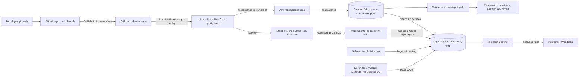
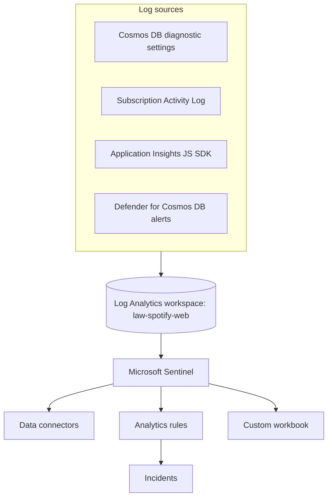

# Mysp0tify — Complete Azure Deployment Guide

End-to-end record of how this project was deployed to Azure: installing the CLI,
provisioning every resource, wiring them together, and setting up CI/CD — with an
explanation of what each component is and why it's there. This reflects the actual
resources live in this subscription today, not a generic template.

## Table of contents

1. [Architecture overview](#1-architecture-overview)
2. [Install and set up the Azure CLI](#2-install-and-set-up-the-azure-cli)
3. [Component reference](#3-component-reference)
4. [Full command sequence](#4-full-command-sequence)
5. [CI/CD pipeline](#5-cicd-pipeline)
6. [Verification](#6-verification)
7. [Notes and gotchas](#7-notes-and-gotchas)
8. [Static Web App custom domain configuration](#8-static-web-app-custom-domain-configuration)
9. [Logging and security monitoring (Microsoft Sentinel)](#9-logging-and-security-monitoring-microsoft-sentinel)

---

## 1. Architecture overview



| Resource | Name | Purpose |
|---|---|---|
| Resource Group | `rg-spotify-web-demo` | Logical container that groups every resource below so they can be managed/billed/deleted together |
| Cosmos DB account | `cosmos-spotify-web-prod` | Serverless NoSQL database engine that stores subscription form submissions |
| Cosmos SQL database | `cosmo-spotify-db` | Logical database inside the Cosmos account |
| Cosmos container | `subscription` (partition key `/email`) | Table-like collection holding subscription documents |
| Static Web App | `spotify-web` | Hosts the static frontend **and** a managed Azure Functions API, fronted by a global CDN with free HTTPS |
| GitHub Actions workflow | `azure-static-web-apps-nice-pond-03e938600.yml` | CI/CD pipeline that builds and deploys on every push to `main` |
| Log Analytics workspace | `law-spotify-web` | Central log store — every log source below is routed here (see [§9](#9-logging-and-security-monitoring-microsoft-sentinel)) |
| Application Insights | `appi-spotify-web` | Client-side telemetry: page views, requests, browser/OS/geo of visitors |
| Microsoft Sentinel | (enabled on `law-spotify-web`) | SIEM on top of the workspace — incidents, analytics rules, workbook |

**Live endpoints:**
- Site: `https://nice-pond-03e938600.7.azurestaticapps.net`
- API: `https://nice-pond-03e938600.7.azurestaticapps.net/api/subscriptions` (`POST`)
- Custom domain (migrating from GitHub Pages): `my-spotify-player.com` — see [§8](#8-custom-apex-domain-migration)

---

## 2. Install and set up the Azure CLI

The Azure CLI (`az`) is the command-line tool used to create and manage every Azure
resource in this guide, so it must be installed first.

### 2.1 Install on Windows

Pick one:

```powershell
# Option 1: winget (recommended, keeps itself updatable)
winget install -e --id Microsoft.AzureCLI

# Option 2: MSI installer (no package manager required)
Invoke-WebRequest -Uri https://aka.ms/installazurecliwindows -OutFile .\AzureCLI.msi
Start-Process msiexec.exe -Wait -ArgumentList '/I AzureCLI.msi /quiet'
Remove-Item .\AzureCLI.msi
```

Restart the terminal afterward so `az` is picked up on `PATH`.

### 2.2 Verify the install

```powershell
az version
```

### 2.3 Sign in and pick the subscription

```powershell
az login
```

This opens a browser for interactive sign-in, then lists every tenant/subscription the
account can access:

```
No     Subscription name     Subscription ID                       Tenant
-----  --------------------  ------------------------------------  -----------------
[1] *  Azure subscription 1  f88d752c-cc1d-4c06-8e17-a67cb9311bf6  Default Directory
```

Selecting `1` sets that subscription as the active target for every subsequent `az`
command in the session. If you need to switch later without re-running `login`:

```powershell
az account set --subscription "<SUBSCRIPTION-NAME-OR-ID>"
```

---

## 3. Component reference

### Resource Group
A pure management boundary — it has no cost itself. Everything created "inside" it
(Cosmos DB, Static Web App) can be deleted in one shot with `az group delete`, and RBAC/
cost-tracking can be scoped to it. A region is required at creation time but only
matters for the resource group's own metadata; the resources inside can live in
different regions.

### Azure Cosmos DB (serverless)
A globally-distributed NoSQL database. Three levels of nesting:
- **Account** (`cosmos-spotify-web-prod`) — the top-level Cosmos resource; owns the
  endpoint URL and the auth keys.
- **Database** (`cosmo-spotify-db`) — a namespace inside the account.
- **Container** (`subscription`) — where documents actually live, similar to a table.
  Requires a **partition key** chosen up front (`/email` here) that Cosmos uses to
  distribute data and route point-reads efficiently; this cannot be changed later
  without recreating the container.

`EnableServerless` was used instead of provisioned throughput (RU/s) so cost is
pay-per-request — appropriate for a low/unpredictable-traffic app instead of paying for
reserved capacity 24/7. Free tier (one per subscription, waives RU/storage costs) was
attempted first but was already consumed by another account in this subscription, so
this account runs in standard serverless billing (still very cheap at low volume).

### Azure Static Web Apps (SWA)
A hosting service purpose-built for static frontends + serverless APIs:
- Serves everything in `app_location` (`/` — the HTML/CSS/JS/assets at the repo root)
  from a global CDN, with free auto-provisioned HTTPS and a `*.azurestaticapps.net`
  hostname.
- Auto-detects and deploys the Azure Functions app in `api_location` (`api`) as a
  **managed** Functions backend — no separate Function App resource, plan, or billing
  to manage; it shares the SWA's free/standard plan.
- `--login-with-github` wires the two together: it registers the GitHub repo as the
  deployment source, generates a GitHub Actions workflow file, commits it straight to
  the target branch, and drops a deployment API token into the repo's GitHub secrets —
  all without the token ever being handled manually.
- **App settings** (`az staticwebapp appsettings set`) are the SWA equivalent of
  Function App settings: key/value pairs injected as environment variables at runtime
  for the managed API (used here for `COSMOS_ENDPOINT`, `COSMOS_KEY`,
  `COSMOS_DATABASE`, `COSMOS_CONTAINER` — see [api/cosmos.js](api/cosmos.js)). They are
  never committed to source control.

### GitHub Actions workflow
The CI/CD engine. Explained in detail in [§5](#5-cicd-pipeline).

---

## 4. Full command sequence

Each command below was run in order, with what it does and why.

### 4.1 Create the resource group
```powershell
az group create --name rg-spotify-web-prod --location southeastasia
```
First attempt at a resource group (later deleted and recreated — see 4.5).

### 4.2 Inspect existing Cosmos accounts
```powershell
az cosmosdb list --output table
az cosmosdb show --name spotify-web --query "{name:name, resourceGroup:resourceGroup, endpoint:documentEndpoint, freeTier:enableFreeTier}" --output table
```
Checked whether a Cosmos account already existed in the subscription before creating a
new one. The `show` call failed with `(--resource-group | --ids) are required` because
`show` needs the account's resource group (or full resource ID) to disambiguate — the
account name alone isn't enough.

### 4.3 Attempt to list Cosmos SQL databases
```powershell
az cosmosdb sql database list --account-name spotify-web --resource-group <RG_FROM_ABOVE> --output table
```
Failed locally: `<RG_FROM_ABOVE>` was left as a literal placeholder, and PowerShell
interprets a bare `<` as the (unsupported) input-redirection operator, throwing
`RedirectionNotSupported`. Placeholders must always be substituted with real values
before running a command.

### 4.4 Delete the abandoned resource group
```powershell
az group delete --name rg-spotify-web-prod --yes --no-wait
```
Removed the first resource group (and anything in it) once a clean, clearly-scoped demo
environment was preferred over the ambiguous pre-existing `spotify-web` account.
`--yes` skips the confirmation prompt; `--no-wait` returns immediately instead of
blocking on the (slow) delete, which continues in the background.

### 4.5 Create the real resource group
```powershell
az group create --name rg-spotify-web-demo --location southeastasia
```
Final resource group used for every resource in this deployment.

### 4.6 Attempt Cosmos DB with free tier
```powershell
az cosmosdb create --name cosmos-spotify-web-prod --resource-group rg-spotify-web-demo `
  --locations regionName=southeastasia failoverPriority=0 `
  --capabilities EnableServerless --enable-free-tier true
```
Failed: `Free tier has already been applied to another Azure Cosmos DB account in this
subscription` — free tier is capped at **one account per subscription**, not per
resource group.

### 4.7 Create Cosmos DB (serverless, standard billing)
```powershell
az cosmosdb create --name cosmos-spotify-web-prod --resource-group rg-spotify-web-demo `
  --locations regionName=southeastasia failoverPriority=0 `
  --capabilities EnableServerless
```
Succeeded. Creates the Cosmos account with serverless billing (pay-per-request, no
reserved throughput).

### 4.8 Create the SQL database
```powershell
az cosmosdb sql database create --account-name cosmos-spotify-web-prod `
  --resource-group rg-spotify-web-demo --name cosmo-spotify-db
```
Creates the logical database inside the account.

### 4.9 Create the container
```powershell
az cosmosdb sql container create --account-name cosmos-spotify-web-prod `
  --resource-group rg-spotify-web-demo --database-name cosmo-spotify-db `
  --name subscription --partition-key-path "/email"
```
Creates the `subscription` container. Partition key `/email` matches how
[api/index.js](api/index.js) looks up and de-duplicates subscriptions.

### 4.10 Retrieve the primary key
```powershell
az cosmosdb keys list --name cosmos-spotify-web-prod `
  --resource-group rg-spotify-web-demo --query primaryMasterKey --output tsv
```
Fetches the master key used as `COSMOS_KEY` by the API. `--query`/`--output tsv`
extract just the raw key string instead of the full JSON payload.

### 4.11 Confirm no Static Web App exists yet
```powershell
az staticwebapp list --output table
```
Confirmed no `spotify-web` SWA existed yet in this subscription/resource group. A
leftover `.github/workflows` file from an earlier, deleted SWA attempt was removed from
the repo first, so the next command could generate a clean workflow instead of
conflicting with a stale one.

### 4.12 Create the Static Web App, linked to GitHub
```powershell
az staticwebapp create --name spotify-web --resource-group rg-spotify-web-demo `
  --source https://github.com/13ntlent-afk/Mysp0tify --branch main `
  --login-with-github
```
`--login-with-github` triggers a device-code OAuth flow (approved in the browser), then
automatically:
- Registers the GitHub repo/branch as the deployment source.
- Generates and commits a GitHub Actions workflow
  (`azure-static-web-apps-nice-pond-03e938600.yml`) directly to `main`.
- Adds the deployment API token as a repo secret
  (`AZURE_STATIC_WEB_APPS_API_TOKEN_NICE_POND_03E938600`) so the workflow can
  authenticate to Azure without manual secret handling.

### 4.13 Wire Cosmos credentials into the Static Web App's API
```powershell
az staticwebapp appsettings set --name spotify-web --resource-group rg-spotify-web-demo `
  --setting-names `
  COSMOS_ENDPOINT="https://cosmos-spotify-web-prod.documents.azure.com:443/" `
  COSMOS_KEY="<primary key from 4.10>" `
  COSMOS_DATABASE="cosmo-spotify-db" `
  COSMOS_CONTAINER="subscription"
```
Injects the four values [api/cosmos.js](api/cosmos.js) reads via `process.env` at
runtime, so the managed Functions API can connect to Cosmos DB.

### 4.14 Verify configuration
```powershell
az staticwebapp appsettings list --name spotify-web --resource-group rg-spotify-web-demo -o json
```
Confirms the four settings above actually persisted.

### 4.15 Sync the auto-generated workflow locally
```powershell
git fetch origin main
git pull origin main
```
Step 4.12 pushed the new workflow file straight to `origin/main`; pulling brings that
commit into the local clone.

---

## 5. CI/CD pipeline

File: [.github/workflows/azure-static-web-apps-nice-pond-03e938600.yml](.github/workflows/azure-static-web-apps-nice-pond-03e938600.yml)
(auto-generated by `az staticwebapp create --login-with-github`, not hand-written).

```yaml
on:
  push:
    branches: [main]
  pull_request:
    types: [opened, synchronize, reopened, closed]
    branches: [main]
```
Runs on every push to `main` (production deploy) and on every pull request targeting
`main` (deploys a temporary **staging environment** per PR, so changes can be reviewed
live before merging).

```yaml
jobs:
  build_and_deploy_job:
    if: github.event_name == 'push' || (github.event_name == 'pull_request' && github.event.action != 'closed')
```
Skips the build job when a PR is merely closed without merging (nothing to deploy).

```yaml
    steps:
      - uses: actions/checkout@v3
      - uses: Azure/static-web-apps-deploy@v1
        with:
          azure_static_web_apps_api_token: ${{ secrets.AZURE_STATIC_WEB_APPS_API_TOKEN_NICE_POND_03E938600 }}
          repo_token: ${{ secrets.GITHUB_TOKEN }}
          action: "upload"
          app_location: "/"
          api_location: "api"
          output_location: ""
```
- **`checkout@v3`** — clones the repo into the runner.
- **`Azure/static-web-apps-deploy@v1`** — the official Oryx-based build/deploy action.
  It installs dependencies for and builds `api_location` (runs `npm install` against
  [api/package.json](api/package.json)), packages `app_location` as-is (no build step
  needed for plain HTML/CSS/JS), and uploads both to the SWA resource.
- **`azure_static_web_apps_api_token`** — the secret added automatically in step 4.12;
  authenticates the upload to the exact SWA resource without exposing an Azure login.
- **`repo_token: secrets.GITHUB_TOKEN`** — GitHub's own auto-issued, run-scoped token,
  used only to post PR comments/statuses (e.g. the staging URL), not for Azure auth.
- **`output_location: ""`** — no build output folder because there is no bundler; the
  site is deployed exactly as checked out.

```yaml
  close_pull_request_job:
    if: github.event_name == 'pull_request' && github.event.action == 'closed'
    steps:
      - uses: Azure/static-web-apps-deploy@v1
        with:
          action: "close"
```
When a PR closes, tears down its temporary staging environment so preview
deployments don't accumulate indefinitely.

**Result:** every `git push origin main` automatically rebuilds and redeploys both the
static site and the `api` Functions app with zero manual Azure CLI steps after initial
setup.

---

## 6. Verification

```powershell
Invoke-WebRequest -Uri "https://nice-pond-03e938600.7.azurestaticapps.net" -UseBasicParsing
# -> 200 OK, static site is served

Invoke-WebRequest -Uri "https://nice-pond-03e938600.7.azurestaticapps.net/api/subscriptions" `
  -Method POST -Body '{}' -ContentType "application/json" -UseBasicParsing
# -> 400 (validation error, not a routing/connection failure) confirms the managed
#    Functions API and its Cosmos DB wiring are live end-to-end
```

`api/list-subscriptions.js` is a **local developer utility** (`node list-subscriptions.js`
from the `api/` folder) for inspecting stored Cosmos documents directly — it is not an
HTTP-exposed route, unlike `subscriptions` defined in [api/index.js](api/index.js).

---

## 7. Notes and gotchas

- Free tier is a **per-subscription** limit (one account total), not per-resource-group
  — reuse an existing free-tier account where possible instead of trying to create a
  second one.
- PowerShell treats `<` and `>` as redirection operators; never leave placeholder
  tokens like `<RG_FROM_ABOVE>` literally in a command — substitute the real value.
- `az cosmosdb show` (and similar `show` commands) require either `--resource-group` or
  `--ids`; the resource name alone does not disambiguate.
- `az group delete --no-wait` returns immediately; the delete continues in the
  background.
- Keep the Cosmos plan names in [api/validation.js](api/validation.js)'s `PLANS`
  allow-list in sync with the `name` attribute on every `<pay-plan>` element in
  [premium.html](premium.html) — a mismatch (e.g. `FREE trial` vs `Individual`)
  produces an `Unknown plan` validation error at submit time.

---

## 8. Static Web App custom domain configuration

The default `*.azurestaticapps.net` hostname (`nice-pond-03e938600...`) is permanent and
can't be renamed — a **custom domain** is layered on top of it instead. This section
covers how that works in general, then the specific apex-domain migration performed for
`my-spotify-player.com` (previously the GitHub Pages custom domain, via the repo's
[CNAME](CNAME) file, now removed).

### 8.1 The two supported methods

`az staticwebapp hostname set` supports two `--validation-method` values, and which one
you need depends on whether you're adding a **subdomain** or an **apex/root domain**:

| Method | Used for | How it works |
|---|---|---|
| `cname-delegation` (default) | Subdomains, e.g. `www.my-spotify-player.com` | You create a CNAME record pointing the subdomain at the SWA's default hostname; Azure resolves that CNAME itself to confirm you control the domain — no separate token needed. |
| `dns-txt-token` | Apex/root domains, e.g. `my-spotify-player.com` | Root domains cannot have a CNAME record (DNS spec: the apex can only hold an A/AAAA/ALIAS/ANAME/SOA/NS/MX/TXT, never a CNAME), so Azure instead issues a random token you publish as a TXT record to prove ownership, independent of how traffic is actually routed. |

### 8.2 Subdomain flow (`cname-delegation`)

```powershell
az staticwebapp hostname set --name spotify-web --resource-group rg-spotify-web-demo `
  --hostname www.my-spotify-player.com
```
Requires the CNAME record (`www` → `nice-pond-03e938600.7.azurestaticapps.net`) to
already exist and resolve *before* running the command — Azure validates it inline and
the call fails immediately with `(BadRequest) CNAME Record is invalid` if it doesn't
(this is exactly what happened in step 8.3 below when the apex domain was tried with
the default method, since an apex can never satisfy this check).

### 8.3 Apex/root domain flow (`dns-txt-token`) — what was actually run

**Register the hostname:**
```powershell
az staticwebapp hostname set --name spotify-web --resource-group rg-spotify-web-demo `
  --hostname my-spotify-player.com --validation-method dns-txt-token --no-wait
```
The first attempt used the default `cname-delegation` method and failed with
`(BadRequest) CNAME Record is invalid. Please ensure the CNAME record has been
created.` — expected, since apex domains have no CNAME to validate against.
`--no-wait` returns immediately instead of blocking the terminal while Azure polls DNS.

**Retrieve the validation token** (not available immediately — poll until populated):
```powershell
az staticwebapp hostname show --name spotify-web --resource-group rg-spotify-web-demo `
  --hostname my-spotify-player.com --query "{status:status, validationToken:validationToken}"
```
Returned `status: Validating` and a token, e.g. `_1afjxu9razylvrt0s0r1fec1qtkopay`.

**Add DNS records at the domain registrar** (manual, external step — `my-spotify-player.com`
is not an Azure DNS zone, so this can't be done via `az` in this project):

| Type | Host/Name | Value |
|---|---|---|
| TXT | `@` (root) | the `validationToken` above |
| ALIAS / ANAME (preferred) **or** A | `@` (root) | `nice-pond-03e938600.7.azurestaticapps.net` |

The TXT record is purely for **ownership proof**; the ALIAS/ANAME/A record is what
actually routes visitor traffic. Many registrars don't support ALIAS/ANAME/CNAME-
flattening at the apex; if yours doesn't, either switch to a DNS provider that does
(e.g. Cloudflare) or 301-redirect the apex to `www.my-spotify-player.com` and register
`www` as a normal subdomain via `cname-delegation` (8.2) instead.

**Confirm validation completed:**
```powershell
az staticwebapp hostname show --name spotify-web --resource-group rg-spotify-web-demo `
  --hostname my-spotify-player.com --query status
```
Status moves from `Validating` to `Ready` once the TXT record propagates and Azure
re-checks it (minutes to hours, depending on the registrar's TTL).

### 8.4 What happens automatically once validated

- Azure issues and auto-renews a **free managed TLS certificate** for the domain — no
  separate certificate request/upload step, and no cost.
- The domain starts resolving to the same SWA content and API as the default hostname;
  both the default `*.azurestaticapps.net` hostname and the custom domain keep working
  side by side (the default one is never removed).

### 8.5 Changing or removing a custom domain later

```powershell
# Swap to a different domain
az staticwebapp hostname delete --name spotify-web --resource-group rg-spotify-web-demo --hostname my-spotify-player.com
az staticwebapp hostname set --name spotify-web --resource-group rg-spotify-web-demo --hostname <new-domain> --validation-method dns-txt-token
```
Deleting a hostname only detaches it from the SWA (and revokes its managed cert) — it
does not affect the underlying `*.azurestaticapps.net` hostname or delete the DNS
records at the registrar, which must be removed there separately.

---

## 9. Logging and security monitoring (Microsoft Sentinel)

The site stayed on the serverless Static Web App + Cosmos DB architecture (a VM-based
migration was attempted and abandoned — every region/SKU combination available to this
subscription hit quota or capacity errors; see [§7](#7-notes-and-gotchas)). Instead of
moving compute, a full logging/SIEM layer was added **on top of** the existing
resources so the same three questions a VM+syslog+Sentinel setup would answer are still
answered here: *what happened, who did it, and where were they accessing from*.

### 9.1 Why this is possible without a VM

Microsoft Sentinel is not tied to virtual machines — it is a SIEM that runs on top of
**any** Log Analytics workspace. A workspace can ingest logs from many source types
(platform diagnostic logs, Activity Log, Application Insights, Defender for Cloud
alerts, custom API pushes, VM agents, etc.). This project uses four of those sources —
none of them require a VM:



### 9.2 The central log sink — Log Analytics workspace

| Property | Value |
|---|---|
| Name | `law-spotify-web` |
| Resource group | `rg-spotify-web-demo` |
| Region | `southeastasia` |
| SKU | `PerGB2018` (pay-per-GB ingested) |
| Retention | 30 days |

Everything below writes into this one workspace. It is the thing Sentinel is
"onboarded onto" — Sentinel itself has no separate storage, it queries this workspace's
tables with KQL.

```powershell
az provider register --namespace Microsoft.OperationalInsights
az monitor log-analytics workspace create -g rg-spotify-web-demo -n law-spotify-web \
  --location southeastasia --sku PerGB2018 --retention-time 30
```

### 9.3 Onboarding Microsoft Sentinel

Sentinel is enabled "onto" a workspace, not created as its own resource. This required
two REST calls (the `az sentinel` CLI extension's shorthand for this was unreliable):

```powershell
az provider register --namespace Microsoft.SecurityInsights
az provider register --namespace Microsoft.OperationsManagement

# 1. Classic "solution" resource — required before onboarding will succeed
az rest --method put `
  --uri "https://management.azure.com/subscriptions/<SUB_ID>/resourceGroups/rg-spotify-web-demo/providers/Microsoft.OperationsManagement/solutions/SecurityInsights%28law-spotify-web%29?api-version=2015-11-01-preview" `
  --body "@solution-body.json"

# 2. Onboarding state — must use api-version 2024-03-01, not 2023-11-01
az rest --method put `
  --uri "https://management.azure.com/subscriptions/<SUB_ID>/resourceGroups/rg-spotify-web-demo/providers/Microsoft.OperationsInsights/workspaces/law-spotify-web/providers/Microsoft.SecurityInsights/onboardingStates/default?api-version=2024-03-01" `
  --body "{}"
```

### 9.4 Log source 1 — Cosmos DB diagnostic logs (what happened to the data)

A diagnostic setting streams Cosmos DB's own audit/operation logs into the workspace:

```powershell
az provider register --namespace Microsoft.Insights
az monitor diagnostic-settings create --name diag-to-sentinel `
  --resource <cosmos-account-resource-id> `
  --workspace law-spotify-web `
  --logs '[{"category":"DataPlaneRequests","enabled":true},{"category":"QueryRuntimeStatistics","enabled":true},{"category":"ControlPlaneRequests","enabled":true},{"category":"PartitionKeyRUConsumption","enabled":true}]' `
  --metrics '[{"category":"Requests","enabled":true}]'
```

Data lands in **resource-specific tables** (not the generic `AzureDiagnostics` table):
`CDBDataPlaneRequests`, `CDBQueryRuntimeStatistics`, `CDBControlPlaneRequests`,
`CDBPartitionKeyRUConsumption`. Useful columns: `StatusCode`, `ClientIpAddress`,
`OperationName`, `DatabaseName`, `CollectionName`. This answers "who queried/wrote the
subscriptions container, from what IP, and did it succeed or fail".

### 9.5 Log source 2 — Application Insights (who is using the app, and from where)

`appi-spotify-web` is a workspace-based Application Insights resource linked to
`law-spotify-web` (its data lives in the same workspace, in `App*` tables).

- **Frontend**: [`js/appInsights.js`](js/appInsights.js) is loaded as the first
  `<script>` in `<head>` on every page (`index.html`, `download.html`, `premium.html`,
  `help.html`, `Spotify-songs/songs.html`). It dynamically loads the Application
  Insights JS SDK from `https://js.monitor.azure.com/scripts/b/ai.2.min.js`,
  initializes it with the connection string, and calls `trackPageView()`. This is what
  captures real visitor data — browser, OS, city/country, and which page they hit —
  into the `AppPageViews` table (columns: `ClientIP`, `ClientCity`,
  `ClientCountryOrRegion`, `ClientBrowser`, `ClientOS`, `Url`).
- **Backend**: the connection string is also set as a Static Web App app setting
  (`APPLICATIONINSIGHTS_CONNECTION_STRING`) so the managed Functions API can emit
  server-side request telemetry into `AppRequests` if/when it's instrumented.

```powershell
az monitor app-insights component create --app appi-spotify-web -g rg-spotify-web-demo `
  --location southeastasia --workspace law-spotify-web --kind web --application-type web

az staticwebapp appsettings set --name spotify-web -g rg-spotify-web-demo `
  --setting-names APPLICATIONINSIGHTS_CONNECTION_STRING="<connection-string>"
```

### 9.6 Log source 3 — Subscription Activity Log (who changed a resource)

A subscription-level diagnostic setting sends the Azure control-plane audit trail
(every ARM operation — who created/deleted/modified a resource, and from what IP) into
the same workspace, landing in the `AzureActivity` table (`Caller`, `CallerIpAddress`,
`OperationNameValue`, `ActivityStatusValue`, `ResourceGroup`, `ResourceId`).

```powershell
az monitor diagnostic-settings subscription create --name activity-to-sentinel `
  --location southeastasia --workspace law-spotify-web `
  --logs '[{"category":"Administrative","enabled":true},{"category":"Security","enabled":true},{"category":"ServiceHealth","enabled":true},{"category":"Alert","enabled":true},{"category":"Recommendation","enabled":true},{"category":"Policy","enabled":true},{"category":"Autoscale","enabled":true},{"category":"ResourceHealth","enabled":true}]'
```

### 9.7 Log source 4 — Defender for Cosmos DB (security alerts)

Defender for Cloud's Cosmos DB plan (`Standard` tier, 30-day trial) watches the account
for anomalous access patterns (e.g. unusual query patterns, potential SQL injection,
access from Tor exit nodes) and raises alerts into the `SecurityAlert` table.

```powershell
az security pricing create -n CosmosDbs --tier Standard
```

These alerts are what feed Sentinel's `SecurityIncidentCreation` rule below — a real
alert here becomes a Sentinel **incident** automatically, not just a row in a table.

### 9.8 Sentinel data connectors

Two connectors bring platform-level data (as opposed to app-level data, which arrives
directly via the diagnostic settings above) into Sentinel's UI:

- **Defender for Cloud connector** (`AzureSecurityCenter` kind) — surfaces
  `SecurityAlert` rows as native Sentinel alerts/incidents.
- **Azure Activity connector** — this is really just confirming the subscription
  diagnostic setting from [§9.6](#96-log-source-3--subscription-activity-log-who-changed-a-resource)
  is flowing; Sentinel reads `AzureActivity` directly once it exists in the workspace.

### 9.9 Sentinel analytics rules (the actual detections)

Three rules were created (via `az rest`, since the CLI extension's shorthand couldn't
express the required fields for these rule types):

| Rule | Kind | What it does |
|---|---|---|
| `asc-incident-rule` | `MicrosoftSecurityIncidentCreation` | Auto-creates a Sentinel incident for every Defender for Cloud alert on Cosmos DB |
| `cosmos-failed-requests` | `Scheduled` (hourly) | KQL over `CDBDataPlaneRequests`: flags >20 failed requests (`StatusCode >= 400`) in a 5-minute bucket, grouped by `OperationName`/`ClientIpAddress` — catches brute-force/scanning behavior against the API |
| `sensitive-resource-change` | `Scheduled` (hourly) | KQL over `AzureActivity`: flags successful write/delete/regenerate-key operations on the Cosmos DB account or the Static Web App, surfacing `Caller`/`CallerIpAddress` — catches unexpected config or key changes |

### 9.10 Sentinel workbook — "MySp0tify - Usage and Access Monitoring"

A single workbook ties the sources together into 5 KQL-based views: page views by
country/city, API requests and failures over time, Cosmos DB requests and failures,
who is administering the resources (from `AzureActivity`), and Defender for Cloud
security alerts.

### 9.11 Cost control

A monthly budget guards against runaway ingestion/retention cost:

| Property | Value |
|---|---|
| Name | `budget-spotify-web-monitoring` |
| Scope | `rg-spotify-web-demo` |
| Amount | $20/month |
| Alerts | 80% of actual spend, 100% of forecasted spend, emailed |

### 9.12 How to view the logs and alerts in the Azure Portal

1. **Raw logs / KQL**: Azure Portal → `law-spotify-web` → **Logs**. Example queries:
   ```kql
   AppPageViews | order by TimeGenerated desc | take 50
   CDBDataPlaneRequests | where StatusCode >= 400 | order by TimeGenerated desc
   AzureActivity | order by TimeGenerated desc | take 50
   ```
2. **Sentinel incidents**: Portal → **Microsoft Sentinel** → select `law-spotify-web` →
   **Incidents**.
3. **Sentinel workbook**: Sentinel → **Workbooks** → "MySp0tify - Usage and Access
   Monitoring" → **View saved workbook**.
4. **Analytics rules**: Sentinel → **Analytics** → lists the 3 rules above; each can be
   edited, disabled, or have its query/threshold tuned.
5. **Data connectors**: Sentinel → **Data connectors** — shows the Defender for Cloud
   connector status and the Activity Log flow.
6. **Defender for Cloud alerts**: Portal → **Microsoft Defender for Cloud** →
   **Security alerts** (also visible as `SecurityAlert` rows in the workspace and as
   Sentinel incidents via the `asc-incident-rule`).
7. **Cost/budget**: Portal → **Cost Management + Billing** → **Budgets** →
   `budget-spotify-web-monitoring`.

### 9.13 Known limitation

`CDBDataPlaneRequests` can take up to 15 minutes to show data after a request due to
normal diagnostic-log ingestion latency — an empty result immediately after testing the
API does not mean the pipeline is broken. `SecurityAlert`/`SecurityIncident` are
expected to be empty until Defender for Cloud actually detects something anomalous;
this is normal, not a misconfiguration.

