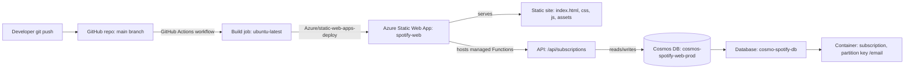

# Mysp0tify — Complete Azure Deployment Guide

End-to-end record of how this project was deployed to Azure: installing the CLI,
provisioning every resource, wiring them together, and setting up CI/CD — with an
explanation of what each component is and why it's there. This reflects the actual
resources live in this subscription today, not a generic template.

## Table of contents

1. [Architecture overview](#1-architecture-overview)
2. [Install and set up the Azure CLI](#2-install-and-set-up-the-azure-cli)
3. [Component reference](#3-component-reference)
4. [Full command sequence](#4-full-command-sequence)
5. [CI/CD pipeline](#5-cicd-pipeline)
6. [Verification](#6-verification)
7. [Notes and gotchas](#7-notes-and-gotchas)

---

## 1. Architecture overview



| Resource | Name | Purpose |
|---|---|---|
| Resource Group | `rg-spotify-web-demo` | Logical container that groups every resource below so they can be managed/billed/deleted together |
| Cosmos DB account | `cosmos-spotify-web-prod` | Serverless NoSQL database engine that stores subscription form submissions |
| Cosmos SQL database | `cosmo-spotify-db` | Logical database inside the Cosmos account |
| Cosmos container | `subscription` (partition key `/email`) | Table-like collection holding subscription documents |
| Static Web App | `spotify-web` | Hosts the static frontend **and** a managed Azure Functions API, fronted by a global CDN with free HTTPS |
| GitHub Actions workflow | `azure-static-web-apps-nice-pond-03e938600.yml` | CI/CD pipeline that builds and deploys on every push to `main` |

**Live endpoints:**
- Site: `https://nice-pond-03e938600.7.azurestaticapps.net`
- API: `https://nice-pond-03e938600.7.azurestaticapps.net/api/subscriptions` (`POST`)

---

## 2. Install and set up the Azure CLI

The Azure CLI (`az`) is the command-line tool used to create and manage every Azure
resource in this guide, so it must be installed first.

### 2.1 Install on Windows

Pick one:

```powershell
# Option 1: winget (recommended, keeps itself updatable)
winget install -e --id Microsoft.AzureCLI

# Option 2: MSI installer (no package manager required)
Invoke-WebRequest -Uri https://aka.ms/installazurecliwindows -OutFile .\AzureCLI.msi
Start-Process msiexec.exe -Wait -ArgumentList '/I AzureCLI.msi /quiet'
Remove-Item .\AzureCLI.msi
```

Restart the terminal afterward so `az` is picked up on `PATH`.

### 2.2 Verify the install

```powershell
az version
```

### 2.3 Sign in and pick the subscription

```powershell
az login
```

This opens a browser for interactive sign-in, then lists every tenant/subscription the
account can access:

```
No     Subscription name     Subscription ID                       Tenant
-----  --------------------  ------------------------------------  -----------------
[1] *  Azure subscription 1  f88d752c-cc1d-4c06-8e17-a67cb9311bf6  Default Directory
```

Selecting `1` sets that subscription as the active target for every subsequent `az`
command in the session. If you need to switch later without re-running `login`:

```powershell
az account set --subscription "<SUBSCRIPTION-NAME-OR-ID>"
```

---

## 3. Component reference

### Resource Group
A pure management boundary — it has no cost itself. Everything created "inside" it
(Cosmos DB, Static Web App) can be deleted in one shot with `az group delete`, and RBAC/
cost-tracking can be scoped to it. A region is required at creation time but only
matters for the resource group's own metadata; the resources inside can live in
different regions.

### Azure Cosmos DB (serverless)
A globally-distributed NoSQL database. Three levels of nesting:
- **Account** (`cosmos-spotify-web-prod`) — the top-level Cosmos resource; owns the
  endpoint URL and the auth keys.
- **Database** (`cosmo-spotify-db`) — a namespace inside the account.
- **Container** (`subscription`) — where documents actually live, similar to a table.
  Requires a **partition key** chosen up front (`/email` here) that Cosmos uses to
  distribute data and route point-reads efficiently; this cannot be changed later
  without recreating the container.

`EnableServerless` was used instead of provisioned throughput (RU/s) so cost is
pay-per-request — appropriate for a low/unpredictable-traffic app instead of paying for
reserved capacity 24/7. Free tier (one per subscription, waives RU/storage costs) was
attempted first but was already consumed by another account in this subscription, so
this account runs in standard serverless billing (still very cheap at low volume).

### Azure Static Web Apps (SWA)
A hosting service purpose-built for static frontends + serverless APIs:
- Serves everything in `app_location` (`/` — the HTML/CSS/JS/assets at the repo root)
  from a global CDN, with free auto-provisioned HTTPS and a `*.azurestaticapps.net`
  hostname.
- Auto-detects and deploys the Azure Functions app in `api_location` (`api`) as a
  **managed** Functions backend — no separate Function App resource, plan, or billing
  to manage; it shares the SWA's free/standard plan.
- `--login-with-github` wires the two together: it registers the GitHub repo as the
  deployment source, generates a GitHub Actions workflow file, commits it straight to
  the target branch, and drops a deployment API token into the repo's GitHub secrets —
  all without the token ever being handled manually.
- **App settings** (`az staticwebapp appsettings set`) are the SWA equivalent of
  Function App settings: key/value pairs injected as environment variables at runtime
  for the managed API (used here for `COSMOS_ENDPOINT`, `COSMOS_KEY`,
  `COSMOS_DATABASE`, `COSMOS_CONTAINER` — see [api/cosmos.js](api/cosmos.js)). They are
  never committed to source control.

### GitHub Actions workflow
The CI/CD engine. Explained in detail in [§5](#5-cicd-pipeline).

---

## 4. Full command sequence

Each command below was run in order, with what it does and why.

### 4.1 Create the resource group
```powershell
az group create --name rg-spotify-web-prod --location southeastasia
```
First attempt at a resource group (later deleted and recreated — see 4.5).

### 4.2 Inspect existing Cosmos accounts
```powershell
az cosmosdb list --output table
az cosmosdb show --name spotify-web --query "{name:name, resourceGroup:resourceGroup, endpoint:documentEndpoint, freeTier:enableFreeTier}" --output table
```
Checked whether a Cosmos account already existed in the subscription before creating a
new one. The `show` call failed with `(--resource-group | --ids) are required` because
`show` needs the account's resource group (or full resource ID) to disambiguate — the
account name alone isn't enough.

### 4.3 Attempt to list Cosmos SQL databases
```powershell
az cosmosdb sql database list --account-name spotify-web --resource-group <RG_FROM_ABOVE> --output table
```
Failed locally: `<RG_FROM_ABOVE>` was left as a literal placeholder, and PowerShell
interprets a bare `<` as the (unsupported) input-redirection operator, throwing
`RedirectionNotSupported`. Placeholders must always be substituted with real values
before running a command.

### 4.4 Delete the abandoned resource group
```powershell
az group delete --name rg-spotify-web-prod --yes --no-wait
```
Removed the first resource group (and anything in it) once a clean, clearly-scoped demo
environment was preferred over the ambiguous pre-existing `spotify-web` account.
`--yes` skips the confirmation prompt; `--no-wait` returns immediately instead of
blocking on the (slow) delete, which continues in the background.

### 4.5 Create the real resource group
```powershell
az group create --name rg-spotify-web-demo --location southeastasia
```
Final resource group used for every resource in this deployment.

### 4.6 Attempt Cosmos DB with free tier
```powershell
az cosmosdb create --name cosmos-spotify-web-prod --resource-group rg-spotify-web-demo `
  --locations regionName=southeastasia failoverPriority=0 `
  --capabilities EnableServerless --enable-free-tier true
```
Failed: `Free tier has already been applied to another Azure Cosmos DB account in this
subscription` — free tier is capped at **one account per subscription**, not per
resource group.

### 4.7 Create Cosmos DB (serverless, standard billing)
```powershell
az cosmosdb create --name cosmos-spotify-web-prod --resource-group rg-spotify-web-demo `
  --locations regionName=southeastasia failoverPriority=0 `
  --capabilities EnableServerless
```
Succeeded. Creates the Cosmos account with serverless billing (pay-per-request, no
reserved throughput).

### 4.8 Create the SQL database
```powershell
az cosmosdb sql database create --account-name cosmos-spotify-web-prod `
  --resource-group rg-spotify-web-demo --name cosmo-spotify-db
```
Creates the logical database inside the account.

### 4.9 Create the container
```powershell
az cosmosdb sql container create --account-name cosmos-spotify-web-prod `
  --resource-group rg-spotify-web-demo --database-name cosmo-spotify-db `
  --name subscription --partition-key-path "/email"
```
Creates the `subscription` container. Partition key `/email` matches how
[api/index.js](api/index.js) looks up and de-duplicates subscriptions.

### 4.10 Retrieve the primary key
```powershell
az cosmosdb keys list --name cosmos-spotify-web-prod `
  --resource-group rg-spotify-web-demo --query primaryMasterKey --output tsv
```
Fetches the master key used as `COSMOS_KEY` by the API. `--query`/`--output tsv`
extract just the raw key string instead of the full JSON payload.

### 4.11 Confirm no Static Web App exists yet
```powershell
az staticwebapp list --output table
```
Confirmed no `spotify-web` SWA existed yet in this subscription/resource group. A
leftover `.github/workflows` file from an earlier, deleted SWA attempt was removed from
the repo first, so the next command could generate a clean workflow instead of
conflicting with a stale one.

### 4.12 Create the Static Web App, linked to GitHub
```powershell
az staticwebapp create --name spotify-web --resource-group rg-spotify-web-demo `
  --source https://github.com/13ntlent-afk/Mysp0tify --branch main `
  --login-with-github
```
`--login-with-github` triggers a device-code OAuth flow (approved in the browser), then
automatically:
- Registers the GitHub repo/branch as the deployment source.
- Generates and commits a GitHub Actions workflow
  (`azure-static-web-apps-nice-pond-03e938600.yml`) directly to `main`.
- Adds the deployment API token as a repo secret
  (`AZURE_STATIC_WEB_APPS_API_TOKEN_NICE_POND_03E938600`) so the workflow can
  authenticate to Azure without manual secret handling.

### 4.13 Wire Cosmos credentials into the Static Web App's API
```powershell
az staticwebapp appsettings set --name spotify-web --resource-group rg-spotify-web-demo `
  --setting-names `
  COSMOS_ENDPOINT="https://cosmos-spotify-web-prod.documents.azure.com:443/" `
  COSMOS_KEY="<primary key from 4.10>" `
  COSMOS_DATABASE="cosmo-spotify-db" `
  COSMOS_CONTAINER="subscription"
```
Injects the four values [api/cosmos.js](api/cosmos.js) reads via `process.env` at
runtime, so the managed Functions API can connect to Cosmos DB.

### 4.14 Verify configuration
```powershell
az staticwebapp appsettings list --name spotify-web --resource-group rg-spotify-web-demo -o json
```
Confirms the four settings above actually persisted.

### 4.15 Sync the auto-generated workflow locally
```powershell
git fetch origin main
git pull origin main
```
Step 4.12 pushed the new workflow file straight to `origin/main`; pulling brings that
commit into the local clone.

---

## 5. CI/CD pipeline

File: [.github/workflows/azure-static-web-apps-nice-pond-03e938600.yml](.github/workflows/azure-static-web-apps-nice-pond-03e938600.yml)
(auto-generated by `az staticwebapp create --login-with-github`, not hand-written).

```yaml
on:
  push:
    branches: [main]
  pull_request:
    types: [opened, synchronize, reopened, closed]
    branches: [main]
```
Runs on every push to `main` (production deploy) and on every pull request targeting
`main` (deploys a temporary **staging environment** per PR, so changes can be reviewed
live before merging).

```yaml
jobs:
  build_and_deploy_job:
    if: github.event_name == 'push' || (github.event_name == 'pull_request' && github.event.action != 'closed')
```
Skips the build job when a PR is merely closed without merging (nothing to deploy).

```yaml
    steps:
      - uses: actions/checkout@v3
      - uses: Azure/static-web-apps-deploy@v1
        with:
          azure_static_web_apps_api_token: ${{ secrets.AZURE_STATIC_WEB_APPS_API_TOKEN_NICE_POND_03E938600 }}
          repo_token: ${{ secrets.GITHUB_TOKEN }}
          action: "upload"
          app_location: "/"
          api_location: "api"
          output_location: ""
```
- **`checkout@v3`** — clones the repo into the runner.
- **`Azure/static-web-apps-deploy@v1`** — the official Oryx-based build/deploy action.
  It installs dependencies for and builds `api_location` (runs `npm install` against
  [api/package.json](api/package.json)), packages `app_location` as-is (no build step
  needed for plain HTML/CSS/JS), and uploads both to the SWA resource.
- **`azure_static_web_apps_api_token`** — the secret added automatically in step 4.12;
  authenticates the upload to the exact SWA resource without exposing an Azure login.
- **`repo_token: secrets.GITHUB_TOKEN`** — GitHub's own auto-issued, run-scoped token,
  used only to post PR comments/statuses (e.g. the staging URL), not for Azure auth.
- **`output_location: ""`** — no build output folder because there is no bundler; the
  site is deployed exactly as checked out.

```yaml
  close_pull_request_job:
    if: github.event_name == 'pull_request' && github.event.action == 'closed'
    steps:
      - uses: Azure/static-web-apps-deploy@v1
        with:
          action: "close"
```
When a PR closes, tears down its temporary staging environment so preview
deployments don't accumulate indefinitely.

**Result:** every `git push origin main` automatically rebuilds and redeploys both the
static site and the `api` Functions app with zero manual Azure CLI steps after initial
setup.

---

## 6. Verification

```powershell
Invoke-WebRequest -Uri "https://nice-pond-03e938600.7.azurestaticapps.net" -UseBasicParsing
# -> 200 OK, static site is served

Invoke-WebRequest -Uri "https://nice-pond-03e938600.7.azurestaticapps.net/api/subscriptions" `
  -Method POST -Body '{}' -ContentType "application/json" -UseBasicParsing
# -> 400 (validation error, not a routing/connection failure) confirms the managed
#    Functions API and its Cosmos DB wiring are live end-to-end
```

`api/list-subscriptions.js` is a **local developer utility** (`node list-subscriptions.js`
from the `api/` folder) for inspecting stored Cosmos documents directly — it is not an
HTTP-exposed route, unlike `subscriptions` defined in [api/index.js](api/index.js).

---

## 7. Notes and gotchas

- Free tier is a **per-subscription** limit (one account total), not per-resource-group
  — reuse an existing free-tier account where possible instead of trying to create a
  second one.
- PowerShell treats `<` and `>` as redirection operators; never leave placeholder
  tokens like `<RG_FROM_ABOVE>` literally in a command — substitute the real value.
- `az cosmosdb show` (and similar `show` commands) require either `--resource-group` or
  `--ids`; the resource name alone does not disambiguate.
- `az group delete --no-wait` returns immediately; the delete continues in the
  background.
- Keep the Cosmos plan names in [api/validation.js](api/validation.js)'s `PLANS`
  allow-list in sync with the `name` attribute on every `<pay-plan>` element in
  [premium.html](premium.html) — a mismatch (e.g. `FREE trial` vs `Individual`)
  produces an `Unknown plan` validation error at submit time.
