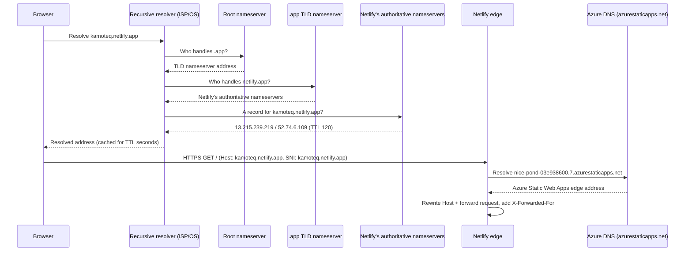
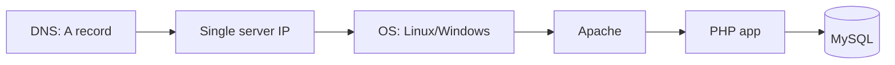
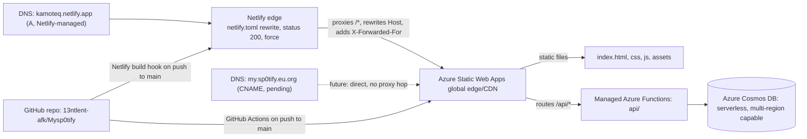
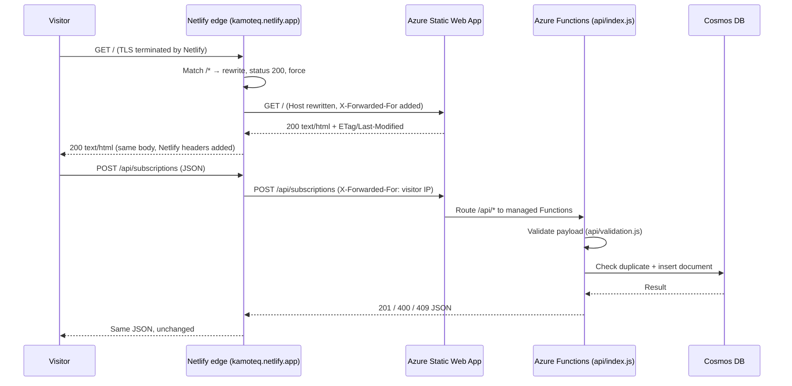

# FQDN, DNS, LAMP/WAMP & Infrastructure — Concepts Behind This Deployment

A conceptual companion to [AZURE_DEPLOYMENT_LOG.md](AZURE_DEPLOYMENT_LOG.md). That file
records *what commands were run*; this one explains *what's actually happening
underneath* — how names resolve to servers, how that maps onto the classic
LAMP/WAMP mental model, and how the infrastructure here differs from a traditional
self-hosted server.

> **Current public entry point: <https://kamoteq.netlify.app/>**
> The site is served to the public through a **Netlify reverse proxy** whose entire
> configuration is the [netlify.toml](netlify.toml) file in this repository. The GitHub
> repository [`13ntlent-afk/Mysp0tify`](https://github.com/13ntlent-afk/Mysp0tify) is
> linked to a Netlify site that redeploys on every push to `main`, but Netlify serves
> **none** of the repository's files — it rewrites every request to the Azure Static Web
> App, which remains the real origin. See [§5](#5-netlify-the-live-public-front-door-kamoteqnetlifyapp)
> for the full setup, configuration, and verification.

## Table of contents

1. [How FQDN works in this context](#1-how-fqdn-works-in-this-context)
2. [DNS](#2-dns)
3. [How LAMP/WAMP relates to this](#3-how-lampwamp-relates-to-this)
4. [How the infrastructure relates to this](#4-how-the-infrastructure-relates-to-this)
5. [Netlify: the live public front door (`kamoteq.netlify.app`)](#5-netlify-the-live-public-front-door-kamoteqnetlifyapp)
6. [Deployment guide: custom FQDN via eu.org + Cloudflare (pending)](#6-deployment-guide-custom-fqdn-via-euorg--cloudflare-pending)

---

## 1. How FQDN works in this context

A **Fully Qualified Domain Name (FQDN)** is a complete, unambiguous address for a host,
specifying every label from the specific machine/service down to the root of DNS:

```
   nice-pond-03e938600 . 7 . azurestaticapps . net .
   └── host label ────┘  └┘  └── domain ────┘ └TLD┘ └ root (usually implicit)

   kamoteq . netlify . app .
   └ site ┘  └ domain┘ └TLD┘ └ root
```

This project now has **three FQDNs in play**, all ultimately answered by the same Azure
Static Web App:

| FQDN | Role | Status |
|---|---|---|
| `kamoteq.netlify.app` | The **public entry point** people are given. A Netlify-assigned hostname on Netlify's shared `netlify.app` domain; serves nothing itself, rewrites every request to the Azure FQDN below (see [§5](#5-netlify-the-live-public-front-door-kamoteqnetlifyapp)) | **Live** |
| `nice-pond-03e938600.7.azurestaticapps.net` | The permanent, Azure-assigned default hostname — the true origin, never changes, always works | **Live** |
| `my.sp0tify.eu.org` | The custom/vanity FQDN — an alias to be layered on top via DNS + domain validation (see [§6](#6-deployment-guide-custom-fqdn-via-euorg--cloudflare-pending)) | Pending eu.org approval |

A domain name by itself (`kamoteq.netlify.app`) is **not** fully qualified until every
label up to the root is known — in casual use the trailing root dot is omitted because
resolvers add it implicitly, but formally `kamoteq.netlify.app.` (with the dot) is the
true FQDN.

**Why it matters here specifically:** both platforms in the chain are **multi-tenant**
services — thousands of customers' sites share the same edge infrastructure and the same
underlying IP addresses. The FQDN in the HTTP `Host` header (and in the TLS SNI
extension during the handshake) is the *only* thing telling each edge which customer's
content to serve for a given request:

- At Netlify's edge, `Host: kamoteq.netlify.app` selects this site out of every other
  `*.netlify.app` site sharing those IPs. The label `kamoteq` is globally unique inside
  Netlify's `netlify.app` zone, which is why claiming a site name is first-come,
  first-served.
- At Azure's edge, `Host: nice-pond-03e938600.7.azurestaticapps.net` selects this Static
  Web App. Netlify **rewrites the `Host` header** to the destination hostname when it
  proxies, which is exactly why this works without registering `kamoteq.netlify.app` as a
  custom domain on the Azure side.

That second point is directly observable — sending Azure the *wrong* `Host` gets nothing:

```powershell
curl.exe -s -o NUL -w "%{http_code}" https://nice-pond-03e938600.7.azurestaticapps.net/ -H "Host: kamoteq.netlify.app"
# 404  — Azure's shared edge has no tenant registered under that hostname

curl.exe -s -o NUL -w "%{http_code}" https://nice-pond-03e938600.7.azurestaticapps.net/
# 200  — the Host header matches a real Static Web App, so content is served
```

This is also why adding a *custom* domain (as opposed to a platform-assigned one)
requires proving ownership — the TXT-record validation in
[§6](#6-deployment-guide-custom-fqdn-via-euorg--cloudflare-pending) — before Azure will
associate an FQDN with this specific Static Web App and issue it a TLS certificate.
Without that check, anyone could claim an FQDN they don't own on shared infrastructure.
Platform-assigned names (`*.netlify.app`, `*.azurestaticapps.net`) skip validation
entirely because the platform already owns the parent zone and hands out labels itself.

---

## 2. DNS

DNS (Domain Name System) is the distributed lookup that turns an FQDN into the
information a client actually needs to connect — an IP address, another name to follow,
or an ownership-proof string.

### 2.1 Resolution chain

With Netlify in front, a single page load involves **two independent DNS resolutions**:
one performed by the visitor's browser (to find Netlify's edge), and a second performed
by Netlify's edge server (to find the Azure origin it was told to proxy to).



Measured for real (short TTL of 120s is Netlify's, chosen so it can move traffic between
edge IPs quickly):

```powershell
Resolve-DnsName kamoteq.netlify.app -Server 8.8.8.8 -Type A

# Name                Type NameHost IPAddress      TTL
# kamoteq.netlify.app    A          13.215.239.219 120
# kamoteq.netlify.app    A          52.74.6.109    120
```

Two A records are returned so the client has a fallback if one edge address is
unreachable; both are anycast-fronted Netlify edge addresses, not machines this project
owns. The `my.sp0tify.eu.org` path in [§6](#6-deployment-guide-custom-fqdn-via-euorg--cloudflare-pending)
follows the same chain but through Cloudflare's nameservers, and resolves *straight* to
Azure with no proxy hop at all.

### 2.2 Record types used in this project

| Record | Used for | Why this type |
|---|---|---|
| **A** (Netlify-managed) | `kamoteq.netlify.app` → Netlify's edge IPs | Created automatically by Netlify inside its own `netlify.app` zone the moment the site was named — **this project performs no DNS administration for the live hostname at all** |
| **CNAME** | Pointing a subdomain (e.g. `my`) at `nice-pond-03e938600.7.azurestaticapps.net` | CNAME aliases one name to another; only legal on non-apex names |
| **TXT** | Proving ownership of an apex domain before Azure will route/certify it | Apex names can't hold a CNAME, so ownership is proven with an arbitrary string instead of a routing record |
| **ALIAS / ANAME** (registrar-dependent) | Routing an apex domain itself to Azure's edge | A registrar-side feature that behaves like a CNAME but is legal at the zone apex — not a real DNS record type, purely a provider convenience that resolves to A/AAAA at query time |
| **A** (fallback, self-managed) | Routing an apex if ALIAS/ANAME isn't supported | Points directly at an IP address instead of a hostname — brittle if Azure's edge IPs change, which is why ALIAS/ANAME or the CNAME-based subdomain approach is preferred |
| **NS** | Delegating `sp0tify.eu.org` from eu.org to Cloudflare | Delegation is the *only* record type eu.org provides ([§6.1](#61-why-this-combination)) |

The first row is the practical reason Netlify went live in minutes while the eu.org
domain is still pending: **a platform-assigned FQDN requires zero DNS work**, because the
platform is already authoritative for the parent zone. Everything below the first row is
work this project has to do itself for a genuinely custom name.

### 2.3 Propagation and TTL

Every DNS record has a **TTL (time to live)** — how long resolvers are allowed to cache
the answer before re-checking the authoritative server. This is why a freshly-added TXT
or CNAME record isn't seen instantly everywhere: every resolver that already cached the
old (or absent) answer keeps serving it until its TTL expires. This is also why
`az staticwebapp hostname show` can report `Validating` for anywhere from minutes to
hours after the record is added correctly — Azure itself is subject to the same caching.

Note that the Netlify hostname sidesteps this entirely: nothing was ever cached for
`kamoteq.netlify.app` before it existed, and its 120-second TTL means even a change of
edge IPs is invisible within two minutes.

### 2.4 Why DNS is decoupled from the application

Notice DNS says nothing about Node.js, Cosmos DB, the Netlify proxy, or the SWA's
internal routing — it only ever answers "where do I send this connection." Everything
after that (which files to serve, which API to run, which database to query, whether to
forward the request somewhere else entirely) is decided by the receiving server based on
the `Host` header, entirely independent of DNS. This separation is what lets one FQDN be
freely repointed (GitHub Pages → Azure → fronted by Netlify, in this project's history)
without touching a single line of application code.

---

## 3. How LAMP/WAMP relates to this

**LAMP** = **L**inux, **A**pache, **M**ySQL, **P**HP (or Python/Perl).
**WAMP** = same stack, on **W**indows instead of Linux.

Both describe the same idea: a single self-managed server running an OS, a web server
process, a database engine, and an application/scripting language, all co-located and
manually administered. It's the traditional model this project's *repository* still
contains an option for ([Dockerfile](Dockerfile), [nginx.conf](nginx.conf),
[k8s-manifests.yaml](k8s-manifests.yaml) — Option B/C/D in
[AZURE_DEPLOYMENT_GUIDE.md](AZURE_DEPLOYMENT_GUIDE.md)) but is **not** what was actually
deployed.

### 3.1 Mapping LAMP/WAMP's layers onto what's actually running

| LAMP/WAMP layer | Traditional role | What replaces it in the live deployment |
|---|---|---|
| **L**inux / **W**indows (OS) | Patch, secure, and manage a full operating system yourself | Nothing to manage — both Netlify's edge and Azure Static Web Apps are serverless; there's no OS you can even log into |
| **A**pache (web server) | Serve static files, terminate TLS, reverse-proxy to the app layer, handle vhosts/custom domains | Split across two managed edges: **Netlify** terminates TLS for `kamoteq.netlify.app` and reverse-proxies (`netlify.toml`, [§5](#5-netlify-the-live-public-front-door-kamoteqnetlifyapp)) — Apache's `mod_proxy`/`ProxyPass` role; **Azure's Static Web Apps CDN** then serves the files and routes by hostname per [§1](#1-how-fqdn-works-in-this-context) — Apache's vhost + `DocumentRoot` role |
| **M**ySQL (relational DB) | Store structured rows (e.g. a `subscriptions` table) | Azure Cosmos DB (NoSQL, document-based) — same *role* (persist subscription data), different data model: JSON documents in a container instead of rows in a table, queried via `/email` partition key instead of a primary key/index |
| **P**HP (server-side app logic) | Handle form submissions, validate input, talk to MySQL | Node.js in [api/index.js](api/index.js) / [api/validation.js](api/validation.js), running as an Azure Functions app — same *role* (validate + persist the subscription form), executed as short-lived serverless invocations instead of long-running Apache/mod_php worker processes |

### 3.2 The reverse proxy: the one LAMP idea still literally in use

Of all the LAMP-era pieces, the **reverse proxy is the one that survived unchanged** —
only its config file format differs. All three of the following express exactly the same
instruction ("take every request for this hostname and fetch it from another server,
transparently, without telling the browser"):

| Stack | Configuration | Notes |
|---|---|---|
| Apache (LAMP) | `ProxyPass / https://origin/`<br>`ProxyPassReverse / https://origin/` | Requires `mod_proxy` + `mod_proxy_http`; `ProxyPreserveHost` controls whether the origin sees the original `Host` |
| nginx (this repo's container path) | `location /api/ { proxy_pass http://127.0.0.1:3000/api/; ... }` in [nginx.conf](nginx.conf) | The same primitive, used here to put the Node API behind the static server inside one container |
| Netlify (the live deployment) | `[[redirects]]` with `status = 200`, `force = true` in [netlify.toml](netlify.toml) | Declarative equivalent; `status = 200` is what makes it a *rewrite* (proxy) rather than a `301`/`302` *redirect* |

The distinction that matters in all three: a **redirect** sends the browser a new URL and
the address bar changes; a **rewrite/proxy** fetches the content server-side and the
visitor never learns the origin exists. That is why `kamoteq.netlify.app` stays in the
address bar even though every byte came from `azurestaticapps.net`.

### 3.3 The key conceptual difference

In LAMP/WAMP, **one FQDN maps to one physical/virtual machine you control** — DNS points
an A record straight at that machine's IP, and Apache's vhost config decides what to
serve based on the `Host` header it receives. In this deployment, **each FQDN maps to a
shared, multi-tenant PaaS edge** (per [§1](#1-how-fqdn-works-in-this-context)) that
performs the same hostname-based routing Apache would have, but across thousands of
unrelated customers' sites, with none of the OS/webserver patching, capacity
planning, or TLS certificate renewal left for you to do. There are now *two* such edges
chained together (Netlify → Azure), and notably neither one costs anything to operate
or required a single line of application code to introduce.

The repo's Dockerfile/nginx.conf/Kubernetes manifests are effectively a **modernized
LAMP-style path not taken**: nginx there plays Apache's role and would run inside a
container you deploy to App Service, Container Apps, or AKS — still self-managed at the
container/orchestration level, just not on bare Linux. The actual deployment in
[AZURE_DEPLOYMENT_LOG.md](AZURE_DEPLOYMENT_LOG.md) skips that entirely in favor of the
fully managed Static Web Apps + Cosmos DB combination.

---

## 4. How the infrastructure relates to this

"Infrastructure" here means everything between a DNS lookup and a rendered page/API
response — compute, networking, storage, and who operates each piece.

### 4.1 Traditional (LAMP/WAMP-style) infrastructure


One machine, one point of failure, capacity fixed by that machine's size, TLS
certificates and OS patches are your responsibility, and scaling means provisioning
more machines and load-balancing between them yourself.

### 4.2 This project's actual infrastructure


- **Compute** is serverless/consumption-based on every tier (Netlify's edge, SWA's static
  hosting, and its managed Functions) — no server to size, patch, or keep online; it
  scales automatically with traffic and costs based on usage rather than reserved
  capacity.
- **Networking/TLS** is handled by two shared edge networks. Netlify issues and renews
  the certificate for `kamoteq.netlify.app` automatically (a `*.netlify.app` wildcard),
  and Azure does the same for its own hostname; the hop between them is itself HTTPS, so
  the request is encrypted end to end with **no certificate management anywhere in this
  project**.
- **Storage/database** (Cosmos DB) is a managed, globally-distributable NoSQL service —
  no MySQL process to install, back up, or fail over manually.
- **Deployment** is push-driven from a single GitHub repository into *two* independent
  targets: the GitHub Actions workflow deploys the real application to Azure (see
  [AZURE_DEPLOYMENT_LOG.md §5](AZURE_DEPLOYMENT_LOG.md#5-cicd-pipeline)), while Netlify's
  own Git integration rebuilds the proxy site (see
  [§5.3](#53-connecting-the-github-repository-to-netlify)). The Netlify build publishes no
  meaningful content — it only re-reads `netlify.toml` — so the two pipelines never
  conflict, and there is no server to SSH into in either.

### 4.3 Why this matters practically

Because DNS in this model only ever points at shared platform edges (never at a specific
machine this project owns), the entire backend — compute, database, TLS, scaling — can
be replaced, resized, or moved without ever touching a DNS record, as long as the FQDN
keeps resolving to something that knows where the app lives. The Netlify layer makes this
even more pronounced: the origin is named in a **file in the repository**
([netlify.toml](netlify.toml)), so repointing the public hostname at a different backend
is a one-line commit rather than a DNS change with propagation delay. That's the same
decoupling described in [§2.4](#24-why-dns-is-decoupled-from-the-application), pushed one
step further.

---

## 5. Netlify: the live public front door (`kamoteq.netlify.app`)

Everything the public touches enters through **<https://kamoteq.netlify.app/>**. This
section documents that layer completely: why it exists, how the GitHub repository was
connected to it, what deploying actually does, how the site was made publicly
accessible, and how to prove the whole chain works.

### 5.1 Why a proxy layer exists at all

The project needed a short, presentable, permanently-available HTTPS hostname
*immediately*, while the intended custom domain (`my.sp0tify.eu.org`) sat in eu.org's
volunteer-run, manual approval queue with no guaranteed completion date
([§6](#6-deployment-guide-custom-fqdn-via-euorg--cloudflare-pending)). The Azure default
hostname (`nice-pond-03e938600.7.azurestaticapps.net`) works perfectly but is
machine-generated and unmemorable.

| Requirement | How Netlify satisfies it |
|---|---|
| A human-readable hostname, today | Site name is chosen at deploy time; `kamoteq.netlify.app` was live within minutes |
| Free HTTPS | Covered by Netlify's managed `*.netlify.app` wildcard certificate — nothing to request, install, or renew |
| No approval process | Netlify owns the `netlify.app` zone, so no ownership validation is needed ([§2.2](#22-record-types-used-in-this-project)) |
| No duplicate hosting to maintain | The rewrite in `netlify.toml` keeps Azure as the single source of truth ([§5.5](#55-netlifytoml-line-by-line)) |
| Zero application changes | The app never learns it is behind a proxy, apart from reading `X-Forwarded-For` ([§5.8](#58-preserving-the-real-visitor-ip)) |
| Reversible | Deleting the site or the `[[redirects]]` block returns everything to the Azure hostname |

### 5.2 What Netlify is — and is not — doing here

This is the single most misread part of the architecture, so stated plainly:

- Netlify **is** the TLS terminator, the DNS answer, and the HTTP entry point for
  `kamoteq.netlify.app`.
- Netlify **is not** hosting this site. It stores no HTML, runs no build, executes no
  functions, and holds no database connection. Every response body originates from the
  Azure Static Web App.
- The repository *is* connected to Netlify and *is* deployed there — but because
  `force = true` shadows the published files ([§5.5](#55-netlifytoml-line-by-line)),
  those files are never served. The deploy exists so Netlify has a site to attach the
  hostname and the `netlify.toml` configuration to, and so that changing the proxy rule
  is a normal `git push`.

That last point is directly provable: [Dockerfile](Dockerfile) exists in the repository
and is part of the Netlify deploy, yet requesting it through the hostname returns 404 —
because the request never reaches Netlify's own file store, it is rewritten to Azure,
which does not publish that file:

```powershell
curl.exe -s -o NUL -w "%{http_code}" https://kamoteq.netlify.app/Dockerfile
# 404  — proof that Netlify's own copy of the repo is not being served
```

### 5.3 Connecting the GitHub repository to Netlify

The site is linked to
[`github.com/13ntlent-afk/Mysp0tify`](https://github.com/13ntlent-afk/Mysp0tify) through
Netlify's Git integration, so deploys are push-driven rather than manual uploads.

1. **Netlify dashboard → Add new site → Import an existing project.**
2. **Deploy with GitHub** → authorize the Netlify GitHub App. Grant it access either to
   all repositories or, preferably, only to `Mysp0tify` (the app requests read access to
   code plus write access to commit statuses and deploy keys, so it can report build
   results back onto pull requests).
3. **Pick the repository** `13ntlent-afk/Mysp0tify`.
4. **Configure the build:**

   | Setting | Value used | Why |
   |---|---|---|
   | Branch to deploy | `main` | Matches the branch the Azure Actions workflow deploys from, so both targets stay in step |
   | Base directory | *(empty)* | The site lives at the repository root |
   | Build command | *(empty)* | Plain HTML/CSS/JS — there is nothing to compile |
   | Publish directory | `.` (repository root) | Netlify requires a publish directory even though the rewrite makes its contents unreachable |
   | Functions directory | *(empty)* | The API runs as Azure Functions, not Netlify Functions |

5. **Deploy site.** Netlify clones the repo, finds [netlify.toml](netlify.toml), applies
   the redirect rule, and publishes.
6. **Rename the site** under *Site configuration → General → Site details → Change site
   name* to `kamoteq`, which immediately provisions the FQDN `kamoteq.netlify.app` and
   its certificate. (Earlier names used during development, such as
   `sp0t1fy.netlify.app`, stop resolving once the site is renamed — a rename is a move,
   not an alias. Note also that `sp0tify.netlify.app` is an unrelated third party's site
   and has never been part of this project.)

From then on, **every push to `main` triggers a fresh Netlify deploy automatically**, in
parallel with the GitHub Actions deploy to Azure. Pull requests additionally get Deploy
Previews at their own temporary hostnames, which proxy to the same Azure origin.

> **Deploy failure worth knowing about:** the first deploy failed with a build-permission
> error, not a code error. Netlify's free plan attributes each build to the *commit
> author*, and rejects builds authored by a Git identity that is not a member of the
> Netlify team. Setting the local Git `user.email` to the GitHub account actually linked
> to the Netlify site made subsequent deploys succeed. Nothing in the repository had to
> change.

### 5.4 The published hostname

| Property | Value |
|---|---|
| Public URL | <https://kamoteq.netlify.app/> |
| DNS | `A 13.215.239.219`, `A 52.74.6.109` (TTL 120), managed entirely by Netlify |
| TLS | Netlify-managed `*.netlify.app` certificate, auto-renewing |
| HSTS | `Strict-Transport-Security: max-age=31536000; includeSubDomains; preload` (set by Netlify) |
| Origin | `https://nice-pond-03e938600.7.azurestaticapps.net` |
| Origin selection | HTTP `Host` header rewritten by Netlify ([§1](#1-how-fqdn-works-in-this-context)) |

### 5.5 `netlify.toml`, line by line

The entire Netlify configuration is one rule:

```toml
[[redirects]]
  from = "/*"
  to = "https://nice-pond-03e938600.7.azurestaticapps.net/:splat"
  status = 200
  force = true
```

| Directive | Meaning | Consequence if changed |
|---|---|---|
| `[[redirects]]` | A TOML array-of-tables entry; each block is one rule, evaluated top-down | Additional blocks could route specific paths elsewhere (e.g. keep `/health` local) |
| `from = "/*"` | Matches every path; `*` is a splat capturing the entire remainder | Narrowing it (e.g. `/api/*`) would proxy only part of the site and serve the repo's own files for the rest |
| `to = "…/:splat"` | The destination; `:splat` re-inserts whatever `*` captured, so `/premium.html` → `/premium.html` and `/api/subscriptions` → `/api/subscriptions`. Query strings are forwarded automatically | Omitting `:splat` would collapse every path onto the origin's root |
| `status = 200` | Makes this a **rewrite/proxy**: Netlify fetches the content server-side and returns it as its own response. A `301`/`302` here would instead bounce the browser to the Azure URL and expose it in the address bar | The whole point of the layer is lost — visitors would see `azurestaticapps.net` |
| `force = true` | Applies the rule **even when a file of that path exists in the published deploy**. Without it, Netlify's default precedence serves its own copy of the repository first and only falls through to the proxy for paths it can't satisfy | The site would silently split-brain: static pages from Netlify's (possibly stale) copy, `/api/*` from Azure |

`force = true` is the directive that turns "a deployed copy of the repo" into "a pure
proxy", and it is what makes the [Dockerfile](Dockerfile) test in
[§5.2](#52-what-netlify-is--and-is-not--doing-here) return 404.

### 5.6 Making the site public

Netlify sites can be gated in several ways; all of them are left **off** so the URL is
openly reachable with no login, password, or invitation:

| Netlify setting | Location | State for this site |
|---|---|---|
| Password protection (site-wide) | Site configuration → Access & security → Visitor access | **Disabled** |
| Password protection (deploy previews / branch deploys) | same panel | **Disabled** |
| Netlify Identity / role-based access | Site configuration → Identity | **Not enabled** |
| Team-members-only access (SSO gating) | Access & security | **Not enabled** |
| Search-engine indexing | Controlled per-deploy; production deploys are indexable | **Allowed** |

Verified anonymously (no cookies, no credentials, from outside the Netlify account):

```powershell
curl.exe -s -o NUL -D - https://kamoteq.netlify.app/

# HTTP/1.1 200 OK
# Cache-Control: public,must-revalidate,max-age=30
# Cache-Status: "Netlify Edge"; fwd=miss; fwd-status=200; stored
# Etag: "76583765"
# Last-Modified: Tue, 18 Aug 2026 16:30:34 GMT
# Server: Netlify
# Strict-Transport-Security: max-age=31536000; includeSubDomains; preload
# X-Nf-Request-Id: 01M0CR26BB4JKJCSETRWJZT4JH
```

A `200` with no `WWW-Authenticate` challenge and no redirect to a login page is the
confirmation that the site is public.

### 5.7 The full request lifecycle



Note the address bar never changes and the visitor never observes an Azure hostname —
the only outward hints are the `Server: Netlify` and `X-Nf-Request-Id` response headers.

### 5.8 Preserving the real visitor IP

Because Netlify makes the origin request, Azure would otherwise see **Netlify's edge IP**
on every single request, making request-level logging useless. Netlify automatically adds
the visitor's address to the `X-Forwarded-For` header, and [api/index.js](api/index.js)
reads it (via a small `getClientIp()` helper) instead of trusting the socket address, so
Application Insights and Log Analytics still record the true origin of each request.

This is the standard reverse-proxy concern from the LAMP world, unchanged: Apache behind
a load balancer needs `mod_remoteip`, and nginx needs `proxy_set_header X-Forwarded-For
$proxy_add_x_forwarded_for` — which is exactly what [nginx.conf](nginx.conf) in this
repository does for its own container-based proxy path.

Browser telemetry sent straight to Application Insights by the page's JavaScript does
**not** traverse Netlify at all, so page-view analytics are unaffected by the proxy layer.

### 5.9 Verifying the whole chain from the command line

Four independent checks, each proving a different link, with the outputs actually
observed:

```powershell
# 1. The Netlify hostname serves the Azure content — identical ETag and Last-Modified
curl.exe -s -o NUL -D - https://kamoteq.netlify.app/                                   # Etag: "76583765"
curl.exe -s -o NUL -D - https://nice-pond-03e938600.7.azurestaticapps.net/             # ETag: "76583765"

# 2. Deep paths keep their path through the :splat capture
curl.exe -s -o NUL -w "%{http_code}" https://kamoteq.netlify.app/premium.html          # 200

# 3. The API is proxied too, and it is genuinely Azure answering:
#    the Azure-specific X-Ms-Middleware-Request-Id header survives the hop
curl.exe -s -i -X POST https://kamoteq.netlify.app/api/subscriptions `
  -H "Content-Type: application/json" -d '{\"email\":\"not-an-email\"}'
# HTTP/1.1 400 Bad Request
# Server: Netlify
# X-Ms-Middleware-Request-Id: 537346f0-e998-4c54-9f10-83ad0bd630db
# {"error":"Validation failed.","details":[ ... "Please enter a valid email address." ... ]}

# 4. Netlify serves none of its own deployed files (see §5.2)
curl.exe -s -o NUL -w "%{http_code}" https://kamoteq.netlify.app/Dockerfile            # 404
```

Check 3 is the strongest single piece of evidence: a Netlify-only deployment could not
produce an Azure middleware request ID, nor run the Functions validation logic, nor reach
Cosmos DB.

### 5.10 Operational notes, trade-offs and rollback

- **One extra network hop.** Every request pays a Netlify-edge → Azure-edge round trip.
  Netlify's edge cache (`Cache-Status: "Netlify Edge"; hit`) absorbs much of this for
  static assets, honouring the origin's `Cache-Control: public, must-revalidate,
  max-age=30`.
- **A second point of failure.** If Netlify has an outage, `kamoteq.netlify.app` fails
  even though Azure is healthy. The Azure hostname always remains a working bypass, which
  is why it is documented rather than hidden.
- **Free-plan limits apply to proxied traffic.** Because responses flow through Netlify,
  they count against the account's bandwidth allowance even though Netlify stores nothing.
- **The origin is hard-coded in the repository.** If the Static Web App is recreated, its
  generated hostname changes and [netlify.toml](netlify.toml) must be updated and pushed;
  nothing else in the chain needs touching.
- **Rollback is trivial.** Removing the `[[redirects]]` block turns the site into an
  ordinary Netlify-hosted copy of the repository; deleting the Netlify site entirely
  leaves Azure serving exactly as before. Neither action touches application code, DNS
  for any other name, or the Azure resources.
- **Coexistence with the custom domain.** When `my.sp0tify.eu.org` is approved
  ([§6](#6-deployment-guide-custom-fqdn-via-euorg--cloudflare-pending)), it points at
  Azure *directly* via CNAME and does not replace the Netlify hostname — the two are
  independent doors into the same origin, and both can stay live indefinitely.

---

## 6. Deployment guide: custom FQDN via eu.org + Cloudflare (pending)

This section is the compiled, step-by-step record of the $0-cost custom domain path
actually chosen for this project, after `my-spotify-player.com` was found to be expired
and unregistrable. It supersedes the apex/Azure DNS approach in
[AZURE_DEPLOYMENT_LOG.md §8](AZURE_DEPLOYMENT_LOG.md#8-static-web-app-custom-domain-configuration)
for the actual custom domain used, while that section remains valid as general reference
for how SWA custom domain validation works.

### 6.1 Why this combination

| Piece | Role | Cost |
|---|---|---|
| eu.org | Registers a free subdomain and delegates it (NS records only) to nameservers you control | $0 |
| Cloudflare (Free plan) | Hosts the actual DNS zone for the registered name; provides free CNAME flattening at the zone apex | $0 |
| Azure Static Web App (`spotify-web`) | Unchanged — same resource used throughout this project | Free tier |

eu.org only ever provides domain delegation (NS records) — see
[nic.eu.org/top-policy.html](https://nic.eu.org/top-policy.html): "To minimize
administration, only domain delegation (NS records) is provided. If you want other
types of resource records, you will have to request a domain delegation for the desired
zone and manage the new zone yourself." That's why a separate free DNS host
(Cloudflare) is required in front of it.

### 6.2 Domain chosen

- Registered with eu.org: `sp0tify.eu.org` (the delegated zone)
- Actual site FQDN: `my.sp0tify.eu.org` — a subdomain created inside the delegated
  zone itself, requiring no additional eu.org approval since anything under a delegated
  zone is fully controlled by its nameservers (Cloudflare, in this case)

### 6.3 Steps performed

1. Cloudflare → Add a site → Connect a domain → `sp0tify.eu.org` → Free plan.
2. In Cloudflare's DNS tab, added:

   | Type | Name | Target | Proxy status |
   |---|---|---|---|
   | CNAME | `my` | `nice-pond-03e938600.7.azurestaticapps.net` | DNS only (grey cloud) |

   DNS-only (not proxied) is used because Azure Static Web Apps already terminates its
   own TLS and CDN — routing through Cloudflare's proxy as well would add a second,
   unnecessary hop and could interfere with Azure's own hostname validation.
3. Copied the 2 nameservers Cloudflare assigned to the zone.
4. Submitted the registration request at [nic.eu.org/arf/](https://nic.eu.org/arf/):
   - Complete domain name: `sp0tify.eu.org`
   - Name 1 / Name 2: the 2 Cloudflare nameservers
   - IP1 / IP2: left blank — glue IPs are only required when a nameserver's own hostname
     lives inside the domain being registered (a circular dependency); Cloudflare's
     nameservers live on `ns.cloudflare.com`, already independently resolvable.
   - eu.org's form validates the request live by querying those nameservers directly for
     SOA/NS answers, so the Cloudflare zone must already exist before submitting.
5. Waiting on eu.org's manual approval e-mail (volunteer-run review, can take hours to
   days). Until approval, `sp0tify.eu.org` will not resolve publicly at all — confirmed
   via `Resolve-DnsName -Server 8.8.8.8`, which returned NXDOMAIN immediately after
   submission.
6. Once approved and resolving, bind the hostname on the Static Web App:

   ```powershell
   az staticwebapp hostname set --name spotify-web --resource-group rg-spotify-web-demo --hostname my.sp0tify.eu.org --no-wait
   ```

   Because `my.sp0tify.eu.org` is a subdomain, not an apex/root domain, the default
   `cname-delegation` validation method is used — no TXT-token step is required (compare
   to the apex flow in
   [AZURE_DEPLOYMENT_LOG.md §8.3](AZURE_DEPLOYMENT_LOG.md#83-apexroot-domain-flow-dns-txt-token)).
7. Once `az staticwebapp hostname show` reports status `Ready`, the site is live at
   `https://my.sp0tify.eu.org` with a free, auto-managed TLS certificate, same as the
   default `azurestaticapps.net` hostname.

### 6.4 Trademark naming note

`sp0tify` (leetspeak for "Spotify") was deliberately kept as a subdomain-qualified name
(`sp0tify.eu.org`, site at `my.sp0tify.eu.org`) rather than registered bare at a TLD,
consistent with this project's existing `Mysp0tify` branding choice — eu.org's policy
explicitly incorporates ICANN/InterNIC trademark rules and can reject or later dispute
names that too closely resemble an existing trademark.

The live Netlify hostname sidesteps the question altogether: `kamoteq` bears no
resemblance to any existing trademark, which is one more reason it is a safe permanent
public entry point rather than a stopgap.

### 6.5 Zero application code changes

Every step above is DNS/registrar/platform configuration only. No file in this
repository changes as part of this custom-domain setup — the application continues to
serve identical content regardless of which FQDN resolves to it, per the decoupling
explained in [§2.4](#24-why-dns-is-decoupled-from-the-application).

The Netlify path in [§5](#5-netlify-the-live-public-front-door-kamoteqnetlifyapp) is the
one exception, and only barely: it adds [netlify.toml](netlify.toml), a pure
configuration file that no application code reads.

### 6.6 Relationship to the live Netlify front door

The two approaches are complementary, not competing:

| | `kamoteq.netlify.app` (live) | `my.sp0tify.eu.org` (pending) |
|---|---|---|
| Path to origin | Visitor → Netlify edge → Azure (proxy hop) | Visitor → Azure (direct, CNAME) |
| DNS managed by | Netlify, automatically | Cloudflare zone, delegated by eu.org |
| Configuration lives in | [netlify.toml](netlify.toml) in this repository | DNS records + `az staticwebapp hostname set` |
| Time to provision | Minutes | Days (manual approval) |
| Azure custom-domain binding required | No — `Host` is rewritten to Azure's own hostname | Yes — `cname-delegation` validation |
| Effect on the other | None | None |

When the eu.org name is approved, it becomes an additional door into the same Azure
origin. Nothing about the Netlify site needs to change, and both hostnames can serve the
identical application indefinitely.
