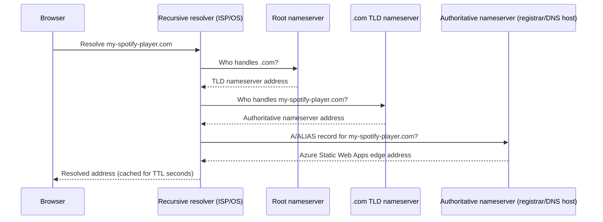
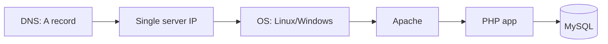
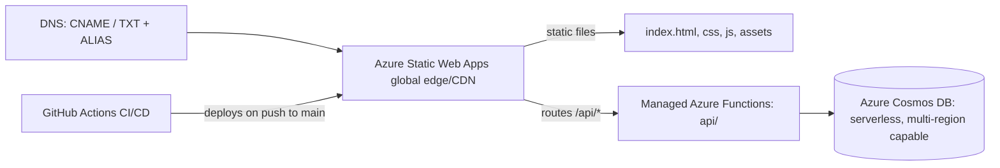

# FQDN, DNS, LAMP/WAMP & Infrastructure — Concepts Behind This Deployment

A conceptual companion to [AZURE_DEPLOYMENT_LOG.md](AZURE_DEPLOYMENT_LOG.md). That file
records *what commands were run*; this one explains *what's actually happening
underneath* — how names resolve to servers, how that maps onto the classic
LAMP/WAMP mental model, and how the infrastructure here differs from a traditional
self-hosted server.

## Table of contents

1. [How FQDN works in this context](#1-how-fqdn-works-in-this-context)
2. [DNS](#2-dns)
3. [How LAMP/WAMP relates to this](#3-how-lampwamp-relates-to-this)
4. [How the infrastructure relates to this](#4-how-the-infrastructure-relates-to-this)

---

## 1. How FQDN works in this context

A **Fully Qualified Domain Name (FQDN)** is a complete, unambiguous address for a host,
specifying every label from the specific machine/service down to the root of DNS:

```
   nice-pond-03e938600 . 7 . azurestaticapps . net .
   └── host label ────┘  └┘  └── domain ────┘ └TLD┘ └ root (usually implicit)
```

This project has **two FQDNs pointing at the same Static Web App**:

| FQDN | Role |
|---|---|
| `nice-pond-03e938600.7.azurestaticapps.net` | The permanent, Azure-assigned default hostname — never changes, always works |
| `my-spotify-player.com` | The custom/vanity FQDN — an alias layered on top via DNS + domain validation (see [AZURE_DEPLOYMENT_LOG.md §8](AZURE_DEPLOYMENT_LOG.md#8-static-web-app-custom-domain-configuration)) |

A domain name by itself (`my-spotify-player.com`) is **not** fully qualified until every
label up to the root is known — in casual use the trailing root dot is omitted because
resolvers add it implicitly, but formally `my-spotify-player.com.` (with the dot) is the
true FQDN.

**Why it matters here specifically:** Azure Static Web Apps is a **multi-tenant**
service — thousands of customers' sites share the same edge infrastructure and the same
underlying IP addresses. The FQDN in the HTTP `Host` header (and in the TLS SNI
extension during the handshake) is the *only* thing telling Azure's edge which
customer's content to serve for a given request. That's precisely why adding a custom
domain requires proving ownership (the TXT-record validation) before Azure will
associate `my-spotify-player.com` with this specific Static Web App and issue it a TLS
certificate — without that check, anyone could claim an FQDN they don't own on shared
infrastructure.

---

## 2. DNS

DNS (Domain Name System) is the distributed lookup that turns an FQDN into the
information a client actually needs to connect — an IP address, another name to follow,
or an ownership-proof string.

### 2.1 Resolution chain



### 2.2 Record types used in this project

| Record | Used for | Why this type |
|---|---|---|
| **CNAME** | Pointing a subdomain (e.g. `www`) at `nice-pond-03e938600.7.azurestaticapps.net` | CNAME aliases one name to another; only legal on non-apex names |
| **TXT** | Proving ownership of the apex domain `my-spotify-player.com` before Azure will route/certify it | Apex names can't hold a CNAME, so ownership is proven with an arbitrary string instead of a routing record |
| **ALIAS / ANAME** (registrar-dependent) | Routing the apex domain itself to Azure's edge | A registrar-side feature that behaves like a CNAME but is legal at the zone apex — not a real DNS record type, purely a provider convenience that resolves to A/AAAA at query time |
| **A** (fallback) | Routing the apex if ALIAS/ANAME isn't supported | Points directly at an IP address instead of a hostname — brittle if Azure's edge IPs change, which is why ALIAS/ANAME or the CNAME-based `www` approach is preferred |

### 2.3 Propagation and TTL

Every DNS record has a **TTL (time to live)** — how long resolvers are allowed to cache
the answer before re-checking the authoritative server. This is why a freshly-added TXT
or CNAME record isn't seen instantly everywhere: every resolver that already cached the
old (or absent) answer keeps serving it until its TTL expires. This is also why
`az staticwebapp hostname show` can report `Validating` for anywhere from minutes to
hours after the record is added correctly — Azure itself is subject to the same caching.

### 2.4 Why DNS is decoupled from the application

Notice DNS says nothing about Node.js, Cosmos DB, or the SWA's internal routing — it
only ever answers "where do I send this connection." Everything after that (which
files to serve, which API to run, which database to query) is decided by the receiving
server based on the `Host` header, entirely independent of DNS. This separation is what
lets one FQDN be freely repointed (GitHub Pages → Azure, in this project's history)
without touching a single line of application code.

---

## 3. How LAMP/WAMP relates to this

**LAMP** = **L**inux, **A**pache, **M**ySQL, **P**HP (or Python/Perl).
**WAMP** = same stack, on **W**indows instead of Linux.

Both describe the same idea: a single self-managed server running an OS, a web server
process, a database engine, and an application/scripting language, all co-located and
manually administered. It's the traditional model this project's *repository* still
contains an option for ([Dockerfile](Dockerfile), [nginx.conf](nginx.conf),
[k8s-manifests.yaml](k8s-manifests.yaml) — Option B/C/D in
[AZURE_DEPLOYMENT_GUIDE.md](AZURE_DEPLOYMENT_GUIDE.md)) but is **not** what was actually
deployed.

### 3.1 Mapping LAMP/WAMP's layers onto what's actually running

| LAMP/WAMP layer | Traditional role | What replaces it in the live deployment |
|---|---|---|
| **L**inux / **W**indows (OS) | Patch, secure, and manage a full operating system yourself | Nothing to manage — Azure Static Web Apps is serverless; there's no OS you can even log into |
| **A**pache (web server) | Serve static files, terminate TLS, reverse-proxy to the app layer, handle vhosts/custom domains | Azure's Static Web Apps global edge/CDN — same *job* (serve files, terminate TLS, route by hostname per [§1](#1-how-fqdn-works-in-this-context)), fully managed |
| **M**ySQL (relational DB) | Store structured rows (e.g. a `subscriptions` table) | Azure Cosmos DB (NoSQL, document-based) — same *role* (persist subscription data), different data model: JSON documents in a container instead of rows in a table, queried via `/email` partition key instead of a primary key/index |
| **P**HP (server-side app logic) | Handle form submissions, validate input, talk to MySQL | Node.js in [api/index.js](api/index.js) / [api/validation.js](api/validation.js), running as an Azure Functions app — same *role* (validate + persist the subscription form), executed as short-lived serverless invocations instead of long-running Apache/mod_php worker processes |

### 3.2 The key conceptual difference

In LAMP/WAMP, **one FQDN maps to one physical/virtual machine you control** — DNS points
an A record straight at that machine's IP, and Apache's vhost config decides what to
serve based on the `Host` header it receives. In this deployment, **the FQDN maps to a
shared, multi-tenant PaaS edge** (per [§1](#1-how-fqdn-works-in-this-context)) that
performs the same hostname-based routing Apache would have, but across thousands of
unrelated customers' sites, with none of the OS/webserver-server patching, capacity
planning, or TLS certificate renewal left for you to do.

The repo's Dockerfile/nginx.conf/Kubernetes manifests are effectively a **modernized
LAMP-style path not taken**: nginx there plays Apache's role and would run inside a
container you deploy to App Service, Container Apps, or AKS — still self-managed at the
container/orchestration level, just not on bare Linux. The actual deployment in
[AZURE_DEPLOYMENT_LOG.md](AZURE_DEPLOYMENT_LOG.md) skips that entirely in favor of the
fully managed Static Web Apps + Cosmos DB combination.

---

## 4. How the infrastructure relates to this

"Infrastructure" here means everything between a DNS lookup and a rendered page/API
response — compute, networking, storage, and who operates each piece.

### 4.1 Traditional (LAMP/WAMP-style) infrastructure


One machine, one point of failure, capacity fixed by that machine's size, TLS
certificates and OS patches are your responsibility, and scaling means provisioning
more machines and load-balancing between them yourself.

### 4.2 This project's actual infrastructure


- **Compute** is serverless/consumption-based on both tiers (SWA's static hosting and
  its managed Functions) — no server to size, patch, or keep online; it scales
  automatically with traffic and costs based on usage rather than reserved capacity.
- **Networking/TLS** is handled by Azure's shared edge network — the same
  infrastructure that made the FQDN ownership check in [§1](#1-how-fqdn-works-in-this-context)
  necessary is also what gives every custom domain free, auto-renewing HTTPS with zero
  certificate management.
- **Storage/database** (Cosmos DB) is a managed, globally-distributable NoSQL service —
  no MySQL process to install, back up, or fail over manually.
- **Deployment** is push-driven: the GitHub Actions workflow (see
  [AZURE_DEPLOYMENT_LOG.md §5](AZURE_DEPLOYMENT_LOG.md#5-cicd-pipeline)) is the only
  "infrastructure" a developer directly interacts with day to day — there's no server to
  SSH into.

### 4.3 Why this matters practically

Because DNS in this model only ever points at Azure's shared edge (never at a specific
machine this project owns), the entire backend — compute, database, TLS, scaling — can
be replaced, resized, or moved without ever touching a DNS record, as long as the FQDN
keeps resolving to a Static Web App resource. That's the same decoupling described in
[§2.4](#24-why-dns-is-decoupled-from-the-application), just viewed from the
infrastructure side instead of the naming side.
