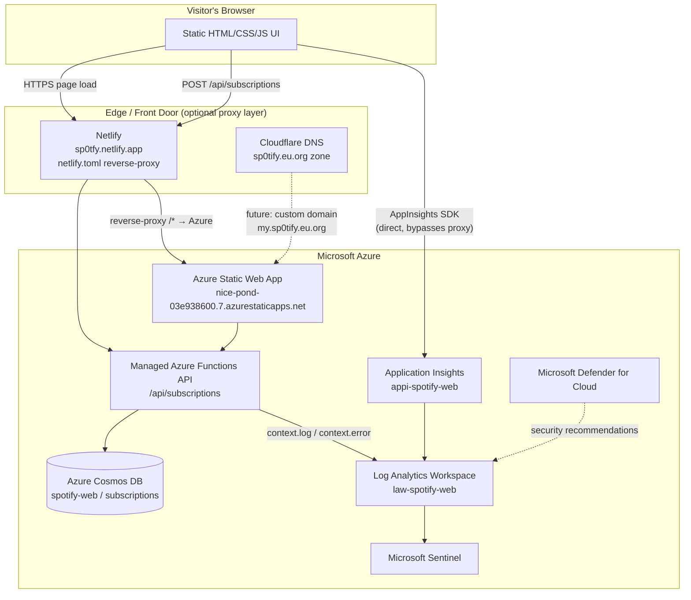
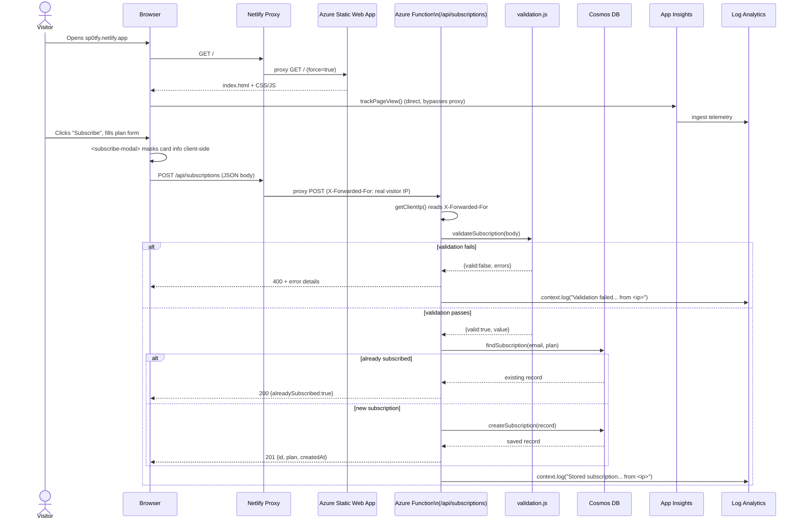
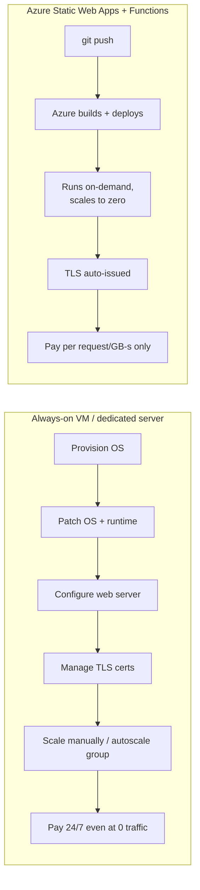
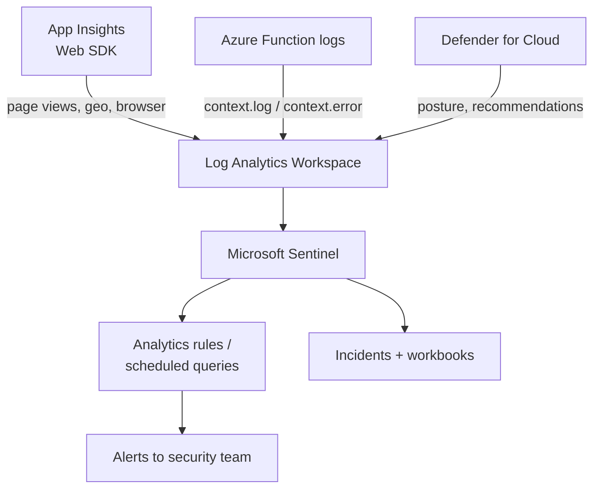
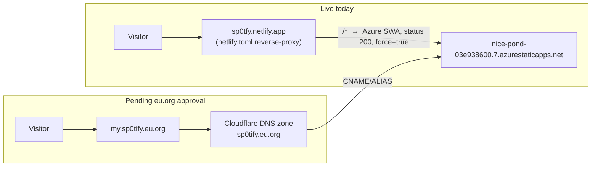

# MySp0tify — Architecture & Monitoring Presentation

> **Purpose of this document:** a script-ready deck outline for presenting MySp0tify —
> a **controlled phishing-simulation / security-awareness training site** styled as a
> Spotify clone — to a technical or semi-technical audience (security team, IT
> leadership, training stakeholders). Every section below has a **diagram**, a
> **"what you're looking at"** table/summary, and a **narrative** block written in
> first person that you can read almost verbatim while presenting, or use as a
> script outline to speak from naturally.
>
> ⚠️ **Ethics/legal framing, say this early and often:** this project exists to
> *simulate* a credential/card-harvesting phishing page in a closed, authorized
> environment so an organization can train users and test detection tooling
> (Sentinel/Defender/App Insights). It is not deployed against the public with
> intent to defraud, and card/credential fields are masked before storage. If your
> audience's context is different (e.g., this should be framed as a plain demo app
> instead of a phishing simulation), swap the wording in this callout box only —
> nothing else in the document depends on the phrase "phishing."

---

## 0. How to use this document

Each of the 9 sections below is built the same way:

1. A **Mermaid diagram** — render it directly in VS Code, GitHub, or any Mermaid
   live-editor for the slide.
2. A **"Reading the diagram"** walkthrough — a plain-language, node-by-node /
   arrow-by-arrow explanation. This is the part to memorize or paraphrase live.
3. A **Narrative / speaker script** — a short paragraph written as if you were
   already talking, meant to bridge from the previous slide and set up the next.

A companion file, **`PRESENTATION_QA.md`**, holds anticipated audience questions
with prepared answers — review it right before presenting.

---

## 1. Architecture Overview



### Reading the diagram

- **Top box (Client):** the only thing the visitor's browser holds is plain
  HTML/CSS/JS — there is no app to install, nothing "runs" on their machine
  beyond a normal web page.
- **Edge box (Netlify + Cloudflare):** this is the "front door." Today, the
  live, working front door is **Netlify** (`sp0tfy.netlify.app`), configured
  purely as a reverse proxy via `netlify.toml` — it owns no files, it just
  relays every request straight through to Azure. Cloudflare is drawn as a
  dotted/future line because it's the DNS host for `sp0tify.eu.org`, the
  permanent custom domain that is still pending eu.org's manual registration
  approval; once approved it becomes an *additional* way in, not a
  replacement.
- **Azure box:** this is where all real work happens — the Static Web App
  serves the HTML/CSS/JS, the co-located Azure Functions API handles the one
  server-side endpoint (`/api/subscriptions`), Cosmos DB stores submitted
  records, and three monitoring services (Application Insights, Log Analytics,
  Sentinel) plus Defender for Cloud observe everything.
- **The two arrows leaving the browser directly:** notice the browser talks to
  Application Insights *directly*, not through Netlify. That's deliberate —
  telemetry about who's visiting and from where is unaffected even if the
  proxy layer changes or goes down.

### Narrative / speaker script

> "At the very top we have nothing but a normal browser loading a normal web
> page — there's no client software, no download, just HTML. Every request
> that page makes goes through one of two doors: today, that door is Netlify,
> which I'll explain shortly is doing nothing except forwarding traffic
> straight to Azure. Everything that actually *does* something — serving
> pages, running the one API endpoint, storing data, and watching what's
> happening — lives entirely inside Azure. And critically, our monitoring
> pipeline doesn't depend on that front door: the browser reports directly to
> Application Insights, so even if we swap Netlify for Cloudflare or a custom
> domain tomorrow, our visibility into who's using the site doesn't change."

---

## 2. End-to-End Request Flow (Client → Frontend → Backend → Cosmos DB → Logging)



### Reading the diagram

- **Two separate flows are shown, stacked:** the top half is just loading the
  page; the bottom half is the actual form submission. Presenting them
  together shows the audience that *browsing* is tracked one way (App
  Insights, automatic) and *submitting data* is tracked another way (function
  logs, explicit).
- **`getClientIp()`** is the small but important detail worth pointing at:
  because Netlify sits in front of Azure, the Function would otherwise see
  Netlify's IP address on every request. This helper reads the
  `X-Forwarded-For` header Netlify adds, so the log line still shows the real
  visitor's IP.
- **`validateSubscription`** is a pure function with no side effects — it
  either rejects the payload (missing fields, bad card format, etc.) or
  returns a cleaned value. Card data is masked (brand + last 4 + expiry only)
  *before* this point ever reaches storage.
- **The "already subscribed" branch** exists so resubmitting the same
  plan/email doesn't create duplicate Cosmos DB rows — it's idempotent by
  design, keyed on `email` as the partition key.
- **Every branch ends in a `context.log`/`context.error` call**, meaning
  success, duplicate, and failure paths are all observable in Log Analytics —
  there's no "silent" outcome.

### Narrative / speaker script

> "Let's follow one real click. A visitor opens the site — that's a simple
> proxy hop through Netlify to Azure, and the moment the page renders, the
> browser independently tells Application Insights 'a page view just
> happened,' completely separate from the proxy. Now they fill out the
> subscribe form. Before anything leaves the browser, the card details are
> already masked client-side — we only ever transmit brand, last four digits,
> and expiry, never the full number. That request goes back through the same
> proxy to the same Azure Function, which first figures out who really sent
> it — using the X-Forwarded-For header, since otherwise every log line would
> just say 'Netlify.' Then it validates the payload, checks Cosmos DB to avoid
> duplicate rows, and finally either fails, hits an existing record, or
> creates a new one — logging every one of those three outcomes with the
> visitor's real IP attached, so if we needed to reconstruct 'who tried what
> and when,' we can."

---

## 3. Tech Stack

| Layer | Technology | Why it's here |
|---|---|---|
| Frontend | Static HTML5 + CSS3 + vanilla JS + Web Components (`<pay-plan>`, `<subscribe-modal>`) | No build step, no framework lock-in, deploys as flat files |
| Hosting | Azure Static Web Apps (Free tier) | Free SSL, free global CDN, native GitHub Actions integration |
| Proxy / alt. hostname | Netlify (`sp0tfy.netlify.app`), config in `netlify.toml` | Instant free hostname while custom domain approval is pending |
| Backend | Azure Functions v4 (Node.js 20, `@azure/functions` programming model) | Serverless, scales to zero, billed only per invocation |
| Database | Azure Cosmos DB (NoSQL API), partitioned on `/email` | Serverless-friendly, low-latency point reads by partition key |
| Telemetry | Application Insights Web SDK (`js/appInsights.js`) | Auto page-view, geo, browser/device tracking, zero backend code |
| Logging | Azure Functions `context.log`/`context.error` → Log Analytics Workspace | Structured, queryable via KQL, feeds Sentinel |
| SIEM | Microsoft Sentinel over `law-spotify-web` | Correlation rules, alerts, incident workbooks |
| Posture mgmt | Microsoft Defender for Cloud | Free-tier security recommendations across the resource group |
| CI/CD | GitHub Actions (`azure-static-web-apps-nice-pond-03e938600.yml`) | Auto build+deploy on every push to `main` |
| DNS (pending) | Cloudflare (`sp0tify.eu.org` zone) + eu.org registration | Free custom domain, once eu.org completes manual approval |

### Narrative / speaker script

> "Nothing here is exotic on purpose. Every layer was picked because it's
> free or near-free at this scale, and because it's managed — meaning
> Microsoft (or Netlify, or Cloudflare) handles patching, scaling, and
> availability, and we focus purely on the app and the monitoring around it."

---

## 4. Why Serverless Instead of a Traditional Server



| Concern | Traditional server (VM/LAMP box) | Serverless (this project) |
|---|---|---|
| OS patching | Your responsibility, ongoing | None — no OS to patch |
| Idle cost | Billed 24/7 whether or not anyone visits | Near $0 at low/no traffic |
| Scaling | Manual autoscale rules, load balancers | Automatic, built into the platform |
| TLS/HTTPS | Manual cert issuance/renewal (or Let's Encrypt automation) | Automatic, free, managed |
| Attack surface | Full OS + web server + everything installed | Just the app code; platform is Microsoft's to secure |
| Deployment | SSH in, copy files, restart services | `git push` → GitHub Actions → done |

### Narrative / speaker script

> "A traditional setup means someone owns an OS forever — patching it,
> hardening it, watching disk space, renewing certificates. None of that
> exists here. There is no server to SSH into. When there's no traffic, we pay
> nothing for compute. When traffic spikes, Azure scales it without anyone
> touching a dial. For a training/simulation tool that might sit idle for
> weeks between exercises, that's not just cheaper — it's fewer things that
> can be misconfigured or forgotten."

---

## 5. Why Node.js Instead of the Traditional LAMP/WAMP Approach

| Concern | LAMP/WAMP (PHP + Apache/MySQL) | Node.js (this project) |
|---|---|---|
| Language boundary | PHP (backend) + separate JS (frontend) — two mental models | Same language (JavaScript) on both sides |
| Hosting fit | Needs a persistent process (Apache/nginx + PHP-FPM) | First-class fit for serverless Functions (event-driven, short-lived) |
| Native Azure SDKs | Possible via community libraries, less first-party support | `@azure/functions`, `@azure/cosmos` are official, actively maintained |
| Async I/O | Traditional PHP model is request-per-process/thread | Node's event loop suits I/O-bound work (DB calls, HTTP) natively |
| Local dev parity | Needs XAMPP/WAMP stack, Apache config, PHP version matching | `npm install` + Azure Functions Core Tools; near-identical to prod |

### Narrative / speaker script

> "We didn't pick Node.js out of trend-chasing — it's the path of least
> resistance for this exact hosting model. Azure Functions' official SDKs for
> both Functions itself and Cosmos DB are Node-first. And because the
> frontend was already JavaScript, using JavaScript on the backend too means
> one language, one set of tooling, one thing to learn — instead of running a
> full Apache/MySQL/PHP stack just to handle a single POST endpoint."

---

## 6. Why This Is More Manageable and Monitorable



| Capability | How it's satisfied here |
|---|---|
| Who is visiting, from where | Application Insights: page views, geolocation (via IP), browser/device |
| What the backend is doing | Structured `context.log`/`context.error` lines, now IP-aware via `getClientIp()` |
| Centralized log search | Log Analytics Workspace, queried with KQL |
| Correlation & alerting | Microsoft Sentinel analytics rules over the same workspace |
| Security posture / misconfig detection | Microsoft Defender for Cloud recommendations |
| Audit trail of infra changes | Azure Activity Log (who changed what resource, when) |

### Narrative / speaker script

> "Everything we just walked through — the app logs, the visitor telemetry —
> lands in one place: the Log Analytics Workspace. That single workspace is
> what Sentinel reads from to build alerting rules and incidents, and it's
> also what Defender for Cloud uses to flag security misconfigurations across
> the resource group. So instead of stitching together a VM's syslog, a web
> server's access log, and an app's own log file from three different places,
> we get one pane of glass, built on services we're already using."

---

## 7. Custom FQDN — How the Domain/Hostname Story Works



### Reading the diagram

- **Two independent hostnames point at the same backend.** `sp0tfy.netlify.app`
  is live right now; `my.sp0tify.eu.org` is the intended permanent domain,
  currently stuck at eu.org's manual/volunteer registration review step (no
  fixed SLA — hours to days). Neither is "the real one" at the expense of the
  other; they can both work simultaneously, or the eu.org domain can later
  redirect/replace the Netlify one.
- **`netlify.toml` is the entire Netlify configuration** — three lines of
  actual logic:
  ```toml
  [[redirects]]
    from = "/*"
    to = "https://nice-pond-03e938600.7.azurestaticapps.net/:splat"
    status = 200
    force = true
  ```
  `status = 200` + `force = true` is what makes this a true reverse proxy
  (rewrite) instead of a redirect — the visitor's browser bar keeps showing
  `sp0tfy.netlify.app`, but the HTML/JSON actually came from Azure.
- **Netlify hosts zero files of its own.** There's no separate deploy of the
  site's HTML on Netlify to keep in sync — one codebase, one source of truth
  (Azure Static Web App), Netlify just relays.
- **Why the visitor IP still shows up correctly:** Netlify automatically adds
  an `X-Forwarded-For` header carrying the original visitor's IP; the Azure
  Function's `getClientIp()` helper reads that header first, falling back to
  Azure's own `x-azure-clientip` header if the site is reached directly.

### Narrative / speaker script

> "We wanted a free, working, presentable hostname today, without waiting on
> a manual domain-registration review. Netlify solved that in minutes: we
> pointed a three-line config file at our existing Azure site and told
> Netlify to force a 200-status rewrite instead of a redirect — so it's
> invisible to the visitor, but Netlify does none of the actual work. Behind
> the scenes, we're also still going after `sp0tify.eu.org` through
> Cloudflare's free DNS, which is the more permanent, brandable option — that
> one's just sitting in a manual review queue. Both can coexist; neither
> required touching a single line of application code."

---

## 8. Deployment — GitHub Actions CI/CD Pipeline

```mermaid
flowchart LR
    Dev[Developer] -->|git push to main| GH[GitHub Repository]
    GH --> Trigger["azure-static-web-apps-nice-pond-03e938600.yml\ntriggers on push/PR to main"]
    Trigger --> Checkout[actions/checkout@v3]
    Checkout --> Build["Azure/static-web-apps-deploy@v1\naction: upload"]
    Build --> Deploy[Deploys app_location '/' \n+ api_location 'api']
    Deploy --> Live[Live at Azure SWA hostname\n+ propagates to Netlify proxy]

    PR[Pull Request opened] -.-> Trigger
    PRClosed[Pull Request closed] --> CloseJob["close_pull_request_job\naction: close"]
```

### Reading the diagram

- **Trigger conditions:** the workflow fires on every push to `main`, and
  separately on pull-request open/sync/reopen (building a temporary staging
  environment) and on PR close (tearing that staging environment down via the
  `close_pull_request_job`).
- **One secret does the heavy lifting:** `AZURE_STATIC_WEB_APPS_API_TOKEN_...`
  is a GitHub Actions secret Azure generated when the SWA resource was
  created; it authorizes the `Azure/static-web-apps-deploy@v1` action to
  upload the build without any manual `az` CLI login.
- **`app_location: "/"` and `api_location: "api"`** tell Azure where the
  static frontend files and the Functions API code live in the repo — both in
  one deploy, one workflow run, no separate pipeline for frontend vs. backend.
- **Because there's no separate Netlify deploy step,** once this workflow
  finishes, `sp0tfy.netlify.app` immediately reflects the change too — it's
  just proxying to the same Azure hostname the workflow just updated.

### Narrative / speaker script

> "There is exactly one deployment pipeline. A push to `main` triggers a
> GitHub Actions workflow that checks out the code and hands it to Azure's own
> Static Web Apps deploy action, using a token Azure issued specifically for
> this. That single action uploads both the static site and the Functions API
> in one pass. And because our Netlify hostname is just a proxy with no files
> of its own, there's nothing extra to deploy there — the moment Azure has the
> new version, both hostnames serve it."

---

## 9. Demonstration

> **[Placeholder — live demo begins here]**

Suggested live-demo script, in order:

1. **Show the live site** — open `https://sp0tfy.netlify.app`, point out the
   address bar still shows the Netlify hostname while it's actually Azure
   underneath.
2. **Walk the "phishing" flow** — click through to Premium, open the
   subscribe modal, fill in a dummy card, submit.
3. **Show Cosmos DB** (Azure Portal → Data Explorer) — the new record just
   landed, with card details masked (brand/last4/expiry only, no full PAN).
4. **Show Application Insights** (Azure Portal → Live Metrics or Logs) — the
   page view + the visitor's browser/geo appearing in near-real time.
5. **Show Log Analytics** — run a KQL query against `traces` showing the
   `"Stored subscription..."` log line with the real visitor IP attached
   (proving the `X-Forwarded-For` fix works end-to-end through the proxy).
6. **Show Sentinel** (if a demo analytics rule/incident exists) — how the same
   data could trigger an alert.
7. **Close with the roadmap** — mention `sp0tify.eu.org` as the pending
   permanent domain, and that no code changes are required when it goes live.

---

## Appendix — Key Files Referenced in This Presentation

| File | Role |
|---|---|
| `netlify.toml` | Netlify reverse-proxy config (the entire "Netlify layer") |
| `api/index.js` | The one API endpoint (`/api/subscriptions`), includes `getClientIp()` |
| `api/cosmos.js` | Cosmos DB client, lazy container creation, find/create helpers |
| `api/validation.js` | Pure validation/masking logic for submitted subscription data |
| `js/appInsights.js` | Client-side Application Insights SDK bootstrap |
| `staticwebapp.config.json` | Azure SWA routing, headers, MIME types, blocked doc routes |
| `.github/workflows/azure-static-web-apps-nice-pond-03e938600.yml` | The CI/CD pipeline |
| `FQDN_DNS_LAMP_INFRASTRUCTURE.md` | Deeper technical detail on FQDN/DNS concepts, the Netlify proxy setup (§5), and the eu.org/Cloudflare domain plan (§6) |
| `PRESENTATION_QA.md` | Companion anticipated Q&A for this presentation |
