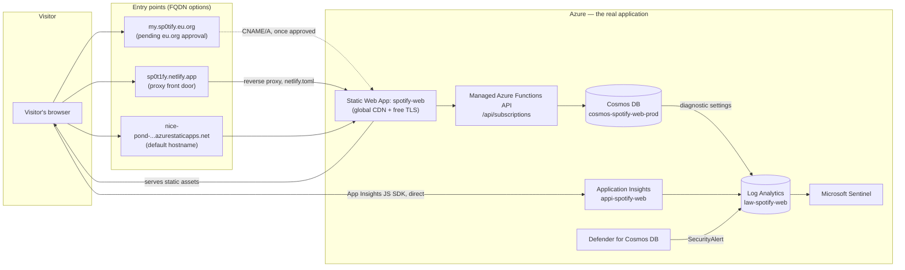
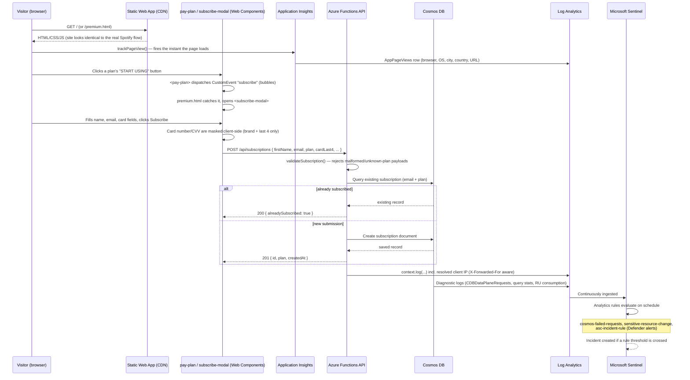
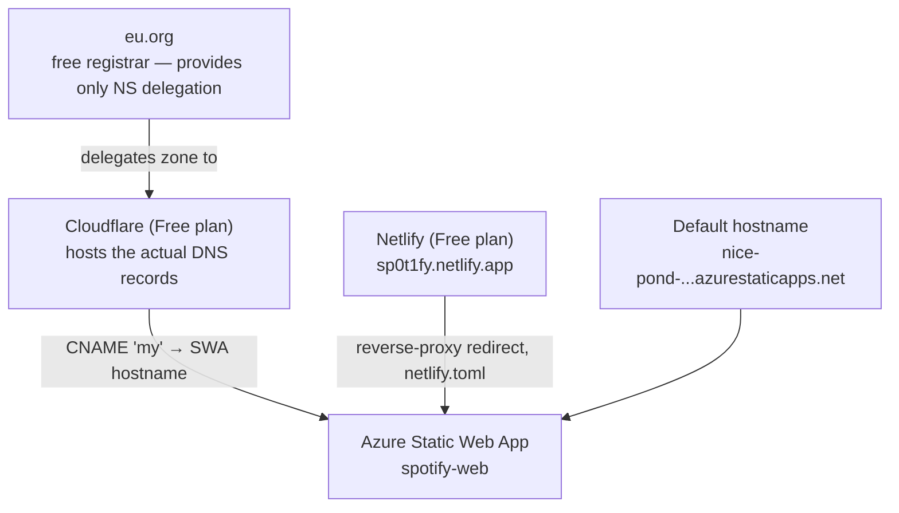
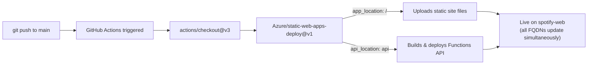

# MySp0tify — Architecture & Monitoring Presentation

A single reference document for presenting this project end-to-end: what it is, how a
request flows through every layer, why each technology was chosen over the
alternatives, how the custom domain works, how deployment is automated, and a
placeholder section to hand off to the live demo.

> **What this project is.** MySp0tify (`sp0tify`) is a controlled **phishing-simulation
> / security-awareness training site** — a pixel-level clone of Spotify's "Premium"
> upsell and subscription flow, built to be indistinguishable from the real thing at the
> UI level. Its purpose is to capture what a real phishing page would capture (name,
> email, and *masked* card details — never a real usable card number), while giving a
> blue team full visibility over **who interacted with it, from where, and when**, via
> Microsoft Sentinel. Every architectural decision in this document is made in service
> of that dual goal: convincing front end, fully observable back end.

---

## Table of contents

1. [Architecture overview](#1-architecture-overview)
2. [End-to-end request flow](#2-end-to-end-request-flow-client--frontend--backend--cosmos-db--logging)
3. [Tech stack](#3-tech-stack)
4. [Why serverless instead of an always-on server](#4-why-serverless-instead-of-an-always-on-server)
5. [Why Node.js instead of the traditional LAMP/WAMP stack](#5-why-nodejs-instead-of-the-traditional-lampwamp-stack)
6. [Why this is more manageable and monitorable](#6-why-this-is-more-manageable-and-monitorable)
7. [How the custom FQDN works](#7-how-the-custom-fqdn-works)
8. [How deployment works — GitHub Actions CI/CD](#8-how-deployment-works--github-actions-cicd)
9. [Demonstration](#9-demonstration)

---

## 1. Architecture overview

| Layer | Resource | Role |
|---|---|---|
| Entry point | Custom FQDN / Netlify proxy / default hostname | Whatever URL a visitor types, all roads lead to the same app |
| Hosting | Azure Static Web App `spotify-web` | Serves HTML/CSS/JS from a global CDN, free managed HTTPS |
| API | Managed Azure Functions (`api/index.js`) | Validates and stores subscription submissions |
| Database | Cosmos DB `cosmos-spotify-web-prod` | Serverless NoSQL store for captured submissions |
| Telemetry | Application Insights `appi-spotify-web` | Client-side visit tracking (who/where/what device) |
| Log sink | Log Analytics `law-spotify-web` | Central store all of the above feed into |
| Detection | Defender for Cosmos DB + Microsoft Sentinel | Turns raw logs into alerts and incidents |

---

## 2. End-to-end request flow: client → frontend → backend → Cosmos DB → logging

**What is captured, and what deliberately is not:**

| Data | Captured? | Where |
|---|---|---|
| First/last name, email, chosen plan | ✅ Yes | Cosmos DB `subscription` container |
| Card brand, last 4 digits, expiry | ✅ Yes (masked only) | Cosmos DB |
| Full card number / CVV | ❌ Never leaves the browser in full — only derived/masked fields are sent | — |
| Visitor IP, city, country, browser, OS, page visited | ✅ Yes | Application Insights → `AppPageViews` |
| Which admin changed which Azure resource, from what IP | ✅ Yes | Subscription Activity Log → `AzureActivity` |
| Anomalous access patterns (e.g. suspicious query bursts) | ✅ Yes | Defender for Cosmos DB → `SecurityAlert` → Sentinel incident |

---

## 3. Tech stack

| Layer | Technology | Why |
|---|---|---|
| Frontend | Vanilla HTML/CSS/JS + native **Web Components** (`customElements.define`, Shadow DOM) | No framework build step; components (`<pay-plan>`, `<subscribe-modal>`, `<custom-header>`) are self-contained, reusable, and load instantly — matches the real Spotify site's snappy feel with zero bundler complexity |
| Backend | **Node.js** on **Azure Functions** (`@azure/functions` v4 programming model) | Same language on client and server end-to-end; functions are short-lived, stateless, and billed per-execution |
| Database | **Azure Cosmos DB** (serverless mode, NoSQL/SQL API) | Schema-flexible documents (a subscription record), automatic partitioning by `/email`, pay-per-request billing |
| Hosting | **Azure Static Web Apps** | Global CDN, free auto-managed TLS, integrated managed Functions, built-in GitHub Actions deployment |
| Telemetry | **Application Insights** (JS SDK) | Real browser-side analytics: who visited, from where, on what device — with zero backend instrumentation required |
| Log platform | **Azure Log Analytics** (`law-spotify-web`) | Single KQL-queryable store that every other monitoring piece writes into |
| SIEM | **Microsoft Sentinel** | Turns raw logs into correlated incidents, with scheduled detection rules and a custom workbook |
| Cloud security posture | **Microsoft Defender for Cloud** (Cosmos DB plan) | Managed threat detection for the database tier, no custom anomaly-detection code needed |
| CI/CD | **GitHub Actions** | Already where the code lives; zero extra CI system to run or pay for |
| DNS / FQDN | **eu.org** (free registrar) + **Cloudflare** (free DNS host) + **Netlify** (proxy fallback) | $0 custom domain path — see [§7](#7-how-the-custom-fqdn-works) |

---

## 4. Why serverless instead of an always-on server

| Concern | Always-on server (VM / App Service always-on) | Serverless (this project) |
|---|---|---|
| Cost when idle | Billed 24/7 whether or not anyone visits | $0 — Static Web Apps Free tier, Cosmos DB serverless bills per request |
| Patching / OS maintenance | You own OS updates, security patches, package upgrades | None — Azure manages the entire runtime |
| Scaling | Manual (resize VM, add instances) or costly auto-scale rules | Automatic and instantaneous — the CDN and Functions scale transparently |
| Attack surface | Full OS + web server + network stack to harden (ports, SSH, firewall rules) | No OS to reach at all; only the app-layer HTTP surface exists |
| Time to first deploy | Provision VM/App Service, install runtime, configure web server, open ports | `az staticwebapp create` — minutes |
| Relevant history in this project | A VM migration was attempted and **abandoned** after every available region/SKU combination hit Azure quota/capacity errors on this subscription | N/A — was never a blocker, since no VM capacity is needed |

For a project whose entire point is to be watched closely rather than to run a large workload, serverless removes an entire category of operational risk (unpatched OS, exposed management ports, idle-cost waste) while still delivering the same functional result.

---

## 5. Why Node.js instead of the traditional LAMP/WAMP approach

| | LAMP/WAMP (Linux/Windows + Apache + MySQL + PHP) | This project (Node.js + Cosmos DB + Functions) |
|---|---|---|
| Language boundary | PHP on the server, JavaScript on the client — two languages, two mental models | JavaScript/JSON on **both** client and server — the same subscription payload shape is used, validated, and stored without translation |
| Web server | Apache/Nginx must be installed, configured, and kept patched | No web server to manage — the platform (Static Web Apps) is the web server |
| Database | MySQL requires a fixed schema (`ALTER TABLE` for every new field) | Cosmos DB stores JSON documents directly — the `subscription` record's shape can evolve without a migration step |
| Process model | Apache/PHP typically run persistent worker processes even when idle | Functions execute only per-request and then stop — no idle process to secure or patch |
| Deployment unit | Sync files to a server (FTP/SSH), restart services | `git push` → GitHub Actions builds and deploys automatically |
| Local dev parity | Needs XAMPP/WAMP/MAMP or a VM to approximate production | `swa start` / `func start` runs the exact same Functions runtime locally as production |

Node.js was chosen specifically so the **same JSON validation logic** (`api/validation.js`) that defines what a valid subscription payload looks like is shared conceptually between the front-end form and the back-end handler — there's no PHP-side re-validation of data shapes already defined in JS, and no SQL schema to keep in sync with form fields.

---

## 6. Why this is better, more manageable, and more monitorable

**Manageable:**
- One `git push` deploys frontend + API together (see [§8](#8-how-deployment-works--github-actions-cicd)) — no separate release process for the database, web server, or app.
- No servers to patch, reboot, or lose to a failed OS update.
- Infrastructure is fully described by a handful of `az` commands (documented in `AZURE_DEPLOYMENT_LOG.md`), so the whole stack can be torn down and rebuilt from scratch.

**Monitorable — this is the core requirement for a phishing-simulation tool:**

| Question a blue team needs answered | How this stack answers it |
|---|---|
| *Who visited the page, and from where?* | Application Insights `AppPageViews` — browser, OS, city, country, per visit, captured client-side, unaffected by any front-door/proxy in front of it |
| *Who submitted the fake subscription form?* | Cosmos DB `subscription` container — name, email, plan, masked card |
| *Is someone hammering the API or scanning it?* | Sentinel analytics rule `cosmos-failed-requests` — flags >20 failed requests in 5 minutes, grouped by IP/operation |
| *Did anyone change a resource's configuration or keys?* | Sentinel analytics rule `sensitive-resource-change` — watches `AzureActivity` for writes/deletes/key-regeneration |
| *Is there an active security threat against the database?* | Defender for Cosmos DB → `SecurityAlert` → auto-promoted to a Sentinel incident via `asc-incident-rule` |
| *What's the overall picture at a glance?* | The custom Sentinel workbook — 5 panels combining all of the above |
| *Are we about to overspend?* | Budget alert `budget-spotify-web-monitoring` — 80%/100% thresholds, emailed |

Every one of these is backed by a managed Azure service, not custom logging code — which is also why it's low-maintenance: there is no log-shipping agent, no self-hosted ELK/Grafana stack, and no syslog daemon to keep alive.

---

## 7. How the custom FQDN works

The project intentionally never depended on owning an expensive domain — it layers three
free/low-cost pieces to get a real, presentable hostname:

1. **eu.org** — a volunteer-run, free domain registrar. It only ever provides **domain
   delegation (NS records)** — no other record types — so a separate DNS host is
   required in front of it. `sp0tify.eu.org` was requested here, with the site itself
   living at the subdomain `my.sp0tify.eu.org`.
2. **Cloudflare (Free)** — hosts the actual DNS zone once eu.org delegates to
   Cloudflare's nameservers. A `CNAME` record points `my` at the Static Web App's
   default hostname. DNS-only (grey cloud), not proxied, since Azure already terminates
   its own TLS/CDN.
3. **Azure Static Web Apps custom domain binding** — once the CNAME resolves, `az
   staticwebapp hostname set --hostname my.sp0tify.eu.org` binds it, and Azure
   auto-issues a free managed TLS certificate.
4. **Netlify proxy fallback** (`sp0t1fy.netlify.app`) — because eu.org's approval is a
   manual, unpredictable human-review step, a Netlify site with a single `netlify.toml`
   redirect rule was added as an **instantly available** front door in the meantime. It
   holds no files of its own — every request is forwarded straight through to the real
   Azure-hosted app, including the API and, transparently, the JS-based telemetry.
5. **Default hostname** (`nice-pond-...azurestaticapps.net`) — always works, no DNS
   dependency at all; useful as a guaranteed fallback during any of the above transitions.

All entry points converge on the exact same application — nothing is duplicated, so
logging, Sentinel, and Cosmos DB behave identically no matter which URL a visitor used.

---

## 8. How deployment works — GitHub Actions CI/CD

- **Trigger**: every `push` to `main`, and every pull request (build-and-preview, then a
  separate job tears the PR's preview environment down when the PR is closed).
- **Job**: a single `ubuntu-latest` runner checks out the repo and hands it to
  `Azure/static-web-apps-deploy@v1`.
- **What gets deployed, in one action**: the static site (`app_location: "/"`) **and**
  the Functions API (`api_location: "api"**) — one push updates both halves of the
  application atomically; there's no separate database migration step since Cosmos DB
  documents are schema-flexible.
- **Secrets**: the deployment token lives in the repo's GitHub secret
  (`AZURE_STATIC_WEB_APPS_API_TOKEN_NICE_POND_03E938600`) — never in source control.
- **Rollback**: revert the commit and push again; the workflow redeploys the previous
  state the same way.
- **No build step required**: this is a static/vanilla-JS project, so there's no
  webpack/vite compile stage — the checkout output *is* the deployable output.

---

## 9. Demonstration

> ⏸️ **[ Presentation pauses here — live demonstration begins ]**
>
> Suggested walkthrough order for the live demo:
> 1. Open the live site (default hostname, custom FQDN, or Netlify proxy — whichever is
>    active at demo time) and browse to **Premium**.
> 2. Submit a subscription with the visible form, showing the masked-card behavior in
>    the browser network tab (only brand/last4/expiry ever leave the client).
> 3. Switch to the **Azure Portal → Log Analytics workspace (`law-spotify-web`) → Logs**
>    and run a live query against `AppPageViews` to show the just-generated visit,
>    including browser/OS/city/country.
> 4. Open **Microsoft Sentinel → Workbooks → "MySp0tify - Usage and Access Monitoring"**
>    to show the aggregated view.
> 5. Open **Sentinel → Analytics** to show the three active detection rules and explain
>    the thresholds.
> 6. (Optional, if time allows) Trigger the `cosmos-failed-requests` rule by sending a
>    burst of invalid requests to `/api/subscriptions` and show the resulting alert.
> 7. Close with **Cost Management → Budgets** to show the $0–$20/month footprint of the
>    entire monitored stack.
