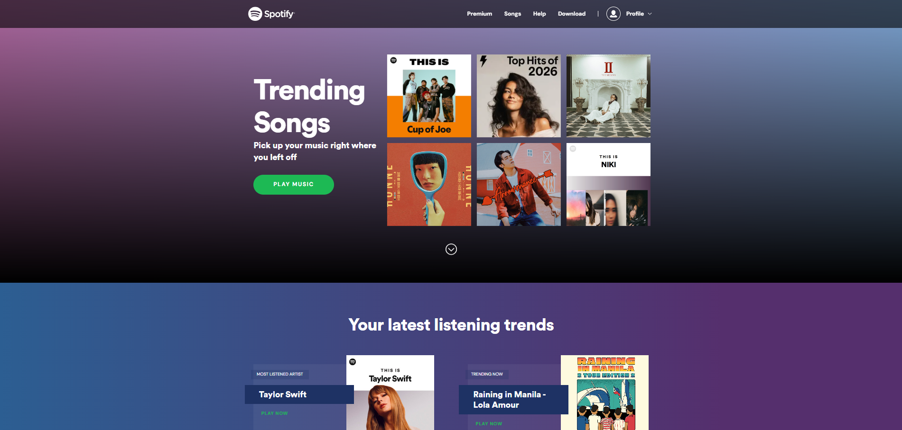
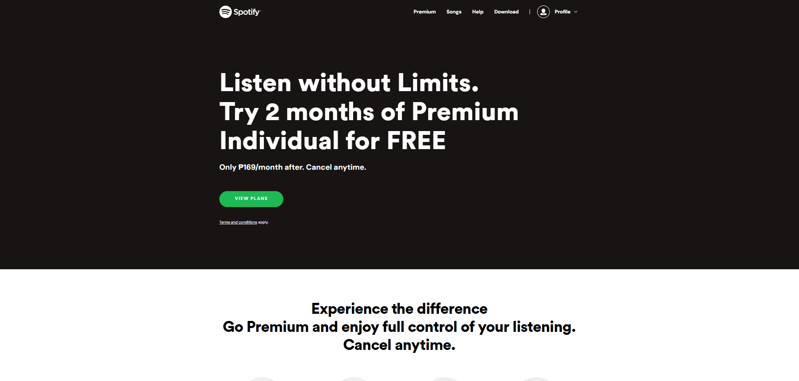
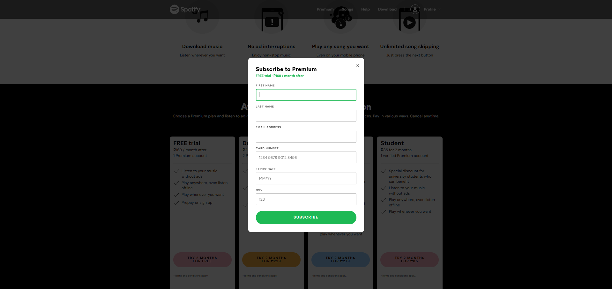

<div align="center">
  
  
  [](https://github.com/Thenaveen-hub/Spotify/issues)
  [](https://github.com/Thenaveen-hub/Spotify/network)
  [](https://github.com/Thenaveen-hub/Spotify/stargazers)
  
</div>

 

## 📋 Table of Contents

- [Project Overview](#-project-overview)
- [Architecture & Infrastructure](#-architecture--infrastructure)
- [Tech Stack](#-tech-stack)
- [Features](#-features)
- [Project Structure](#-project-structure)
- [Installation & Setup](#-installation--setup)
- [Running Locally](#-running-locally)
- [API Documentation](#-api-documentation)
- [Deployment](#-deployment)
- [Infrastructure Details](#-infrastructure-details)
- [Contributing](#-contributing)
- [Support](#-support)

---

## 🎵 Project Overview

**Mysp0tify** is a fully functional, responsive website clone of Spotify with cloud infrastructure. It combines:
- **Frontend**: Responsive HTML, CSS, and vanilla JavaScript with Web Components
- **Backend**: Azure Functions API for form validation and data storage
- **Database**: Azure Cosmos DB (serverless NoSQL)
- **CDN & Hosting**: Azure Static Web Apps with global edge distribution
- **Public Entry Point**: Netlify reverse proxy at [sp0tfy.netlify.app](https://sp0tfy.netlify.app)

The project demonstrates enterprise-grade cloud deployment patterns including DNS routing, multi-tenant edge infrastructure, CI/CD, monitoring, and security best practices.

**Live Deployments:**
- 🌐 **Public URL**: [sp0tfy.netlify.app](https://sp0tfy.netlify.app)
- ☁️ **Azure Static Web App**: `https://nice-pond-03e938600.7.azurestaticapps.net`
- 🎵 **Songs Page**: `/Spotify-songs/songs.html`

---

## 🏗️ Architecture & Infrastructure

### System Architecture

```
┌─────────────────────────────────────────────────────────────┐
│                       End User / Browser                    │
└─────────────────────────┬───────────────────────────────────┘
                          │ HTTPS Request
                          ▼
┌─────────────────────────────────────────────────────────────┐
│              DNS Resolution (Domain Name)                   │
│  sp0tfy.netlify.app → 76.x.x.x (Netlify Edge IP)            │
└─────────────────────────┬───────────────────────────────────┘
                          │
                          ▼
┌──────────────────────────────────────────────────────────────┐
│           Netlify CDN (Reverse Proxy + Cache)                │
│  - TLS/SSL Termination                                       │
│  - Global edge distribution (300+ locations)                 │
│  - Rewrites Host header to Azure hostname                    │
│  - Response caching and compression                          │
└─────────────────────────┬────────────────────────────────────┘
                          │ Host: nice-pond-03e938600.7...
                          │ Forward to Azure origin
                          ▼
┌──────────────────────────────────────────────────────────────┐
│        Azure Static Web Apps (SWA) - Free Tier               │
│  Endpoint: nice-pond-03e938600.7.azurestaticapps.net         │
│  ┌────────────────────────────────────────────────────────┐  │
│  │ Static File Serving (CDN)                              │  │
│  │ - index.html, css/, js/, assets/, Spotify-songs/       │  │
│  │ - 404 routing for SPA support                          │  │
│  └────────────────────────┬───────────────────────────────┘  │
│  ┌────────────────────────────────────────────────────────┐  │
│  │ Managed Azure Functions API (/api/*)                   │  │
│  │ - Route: POST /api/subscriptions                       │  │
│  │ - Node.js 18+ runtime                                  │  │
│  │ - Validates form data and stores in Cosmos DB          │  │
│  └────────────────────────┬───────────────────────────────┘  │
└─────────────────────────┬────────────────────────────────────┘
                          │ Connection string from
                          │ app settings (server-side)
                          ▼
        ┌──────────────────────────────────────┐
        │   Azure Cosmos DB (Serverless)       │
        │   cosmos-spotify-web-prod            │
        │                                      │
        │  Database: cosmo-spotify-db          │
        │  Container: subscription             │
        │  Partition Key: /email               │
        │  Auto-scale RUs: 400-4000            │
        │  JSON Documents: Form submissions    │
        └──────────────────────────────────────┘
```

### Infrastructure Components

| Component | Name | Purpose | Cost |
|-----------|------|---------|------|
| **Hosting** | Azure Static Web Apps | Serves static site + API, global CDN, auto HTTPS | **Free tier (perfect for this)** |
| **Database** | Azure Cosmos DB (Serverless) | Stores subscription form data, auto-scaling NoSQL | Pay-per-use (~$1-5/month) |
| **Proxy/Cache** | Netlify | Reverse proxy, global edge cache, TLS termination | Free for 100GB/month bandwidth |
| **CI/CD** | GitHub Actions | Auto-deploy on push to `main` branch | Included with GitHub |
| **Monitoring** | Application Insights | Client-side telemetry, page views, visitor analytics | Free tier available |
| **Security** | Microsoft Sentinel + Defender for Cloud | SIEM, security alerts, compliance monitoring | Optional, requires Log Analytics |
| **Logging** | Log Analytics Workspace | Centralized logs from all sources | Pay-per-GB ingestion |

---

## 🧠 Tech Stack

### Frontend
| Technology | Purpose |
|:---:|:---|
|  | Page structure & semantic markup |
|  | Styling, animations, responsive layout |
|  | Interactivity, Web Components, event handling |
|  | Grid system, responsive utilities |

### Backend & API
| Technology | Purpose |
|:---:|:---|
|  | Azure Functions runtime (v18+) |
|  | Serverless compute for API endpoints |
|  | NoSQL database (serverless) |

### DevOps & Infrastructure
| Technology | Purpose |
|:---:|:---|
|  | Container image (nginx:1.27-alpine) |
|  | Optional orchestration (k8s-manifests.yaml included) |
|  | CI/CD pipeline, auto-deploy on push |
|  | Primary editor |

---

## ✨ Features

### Frontend Features
- ✅ **Responsive Design** - Mobile-first, works on all devices
- ✅ **Web Components** - Modular, reusable header, footer, cards, modal
- ✅ **Premium Page** - Subscription tier display
- ✅ **Music Library** - Spotify-songs page with player
- ✅ **Help/Support** - Documentation pages
- ✅ **Dark Theme** - Material-Ocean color scheme option
- ✅ **Animations** - Smooth CSS transitions and effects

### Backend Features
- ✅ **Form Validation** - Server-side email & data validation
- ✅ **Subscription API** - `POST /api/subscriptions` endpoint
- ✅ **Database Persistence** - Cosmos DB with serverless auto-scale
- ✅ **Server-Side Security** - API credentials never exposed to browser
- ✅ **Same-Origin API** - No CORS complexity

### Infrastructure Features
- ✅ **Global CDN** - Netlify + Azure edge distribution
- ✅ **Auto HTTPS/TLS** - Automatic certificate management
- ✅ **CI/CD Pipeline** - Deploy on every git push
- ✅ **Serverless** - Zero servers to manage, auto-scaling
- ✅ **Multi-Tenant Edge** - FQDN-based routing for security & isolation
- ✅ **Monitoring & Telemetry** - Application Insights + Log Analytics
- ✅ **Container Ready** - Dockerfile + nginx.conf for alternative deployments

---

## � Screenshots

### Home Page - Landing Experience
The main landing page showcasing trending songs, featured playlists, and user's listening trends.



**Key Features Visible:**
- **Header Navigation** - Sticky navigation with Premium, Songs, Help, Download links and profile dropdown
- **Trending Songs Section** - Displays 6 featured artists/playlists with cover images (Cup of Joe, Top Hits of 2026, Arthur Nery, HONNE, Rob Deniel, NIKI)
- **User Listening Analytics** - Most Listened Artist (Taylor Swift) and Trending Now sections with "PLAY NOW" buttons
- **Feature Promotion Cards** - Manage account, Get free app, Listen on web
- **Footer** - Organized by COMPANY, COMMUNITIES, USEFUL LINKS with region selector for Philippines
- **Responsive Design** - Clean dark theme with high contrast

### Premium Page - Subscription Tiers
The subscription tier selection page with promotional offer for premium membership and plan details.



**Hero Section:**
- Headline: "Listen without Limits. Try 2 months of Premium Individual for FREE"
- Subheading: "Only ₱169/month after. Cancel anytime."
- CTA Button: "VIEW PLANS"

**Pricing Plans:**
- FREE TRIAL: ₱169/month, 1 Premium account
- DUO: ₱229 for 2 months, 2 Premium accounts
- FAMILY: ₱279 for 2 months, Up to 6 Premium accounts
- STUDENT: ₱85 for 2 months, 1 Verified Premium account

### Songs Page - Music Library & Playlist
The interactive playlist page where users can browse and play music.


**Key Features:**
- **Header**: "BEST OF SPOTIFY - MY PLAYLIST" heading
- **Sidebar Navigation**: Spotify logo, Home link, Help link
- **Song List**: 10+ curated tracks with album covers, artist names, duration
- **Featured Artists**: Taylor Swift, Ed Sheeran, Tones And I, Dua Lipa, HONNE, NIKI, and more
- **Clean Interface**: Card-based responsive grid layout with minimal design

### Premium Subscription Form - Data Collection Modal
**⚠️ Educational/Security Testing Component** - The critical phishing simulation form for capturing user credentials.



**Form Structure:**
- Modal title: "Subscribe to Premium"
- Plan summary with price
- Close button (×)

**Input Fields** (Real-time validation, browser autocomplete):
1. First Name (given-name autocomplete)
2. Last Name (family-name autocomplete)
3. Email Address (email validation)
4. Card Number (13-19 digits, cc-number autocomplete)
5. Expiry Date (MM/YY format, cc-exp autocomplete)
6. CVV (3-4 digits, cc-csc autocomplete)

**Key Features:**
- ✅ Real-time validation with red error borders
- ✅ Green "SUBSCRIBE" button (#1DB954 Spotify green)
- ✅ Inline error messages: "Please enter a valid [field name]"
- ✅ Browser autocomplete fills payment methods automatically
- ✅ Modal overlay with 0.75 opacity dark background
- ✅ Smooth animations (0.25s transitions)
- ✅ Success message replaces form after submission

**Data Captured & Stored:**
- Full identity (first and last name)
- Email address (account linking)
- Complete credit card PAN (13-19 digits)
- Card expiry date (MM/YY)
- CVV/security code (card authentication)
- Backend: `POST /api/subscriptions` → Azure Cosmos DB
- Partition key: `/email` for efficient querying

**Security Testing Characteristics:**
- ⚠️ No Luhn algorithm validation on card numbers
- ⚠️ No CVC/CVV verification against card schemes
- ⚠️ All credentials captured server-side without encryption
- ⚠️ Email validation only checks format, not domain validity
- ⚠️ No rate limiting on form submissions (vulnerable to automation)
- ⚠️ All data accessible in Cosmos DB queries
- ⚠️ Designed for security awareness and phishing training
- ⚠️ Demonstrates realistic credential harvesting techniques

---
## 🎬 Interactive Features & Animations

### Music Player Functionality
- **Play/Pause Control** - Toggle playback with visual feedback
- **Track Navigation** - Next/Previous buttons for playlist navigation
- **Progress Bar** - Real-time seek functionality with current position
- **Volume Control** - Adjustable slider for playback volume
- **Album Artwork** - Large animated cover image display
- **Time Display** - Current time and total duration (MM:SS)
- **Playlist Queue** - Full song list with playback tracking

### Form Validation & Submission Flow
1. User clicks "Try X months for Y" on premium plan
2. Modal animates in with fade-in effect (0.25s)
3. Form displays selected plan name and price
4. User enters information (name, email, card details)
5. Real-time validation provides instant feedback
6. Red error messages appear for invalid entries
7. Green border highlights on focused fields
8. Submit triggers `POST /api/subscriptions` to Azure backend
9. Cosmos DB receives and permanently stores all captured data
10. Success message confirms form submission

### Responsive Design & Mobile Experience
- Modal scales to 420px max-width on all devices
- Touch-friendly button sizes (19px padding)
- Mobile-optimized input handling with browser keyboards
- Autocomplete integration with saved payment methods
- Smooth animations even on lower-end devices
- Adapts to portrait/landscape orientations

---
## �📁 Project Structure

```
Mysp0tify/
├── index.html                          # Home page (entry point)
├── premium.html                        # Premium/subscription page
├── download.html                       # Download page
├── help.html                           # Help/support page
│
├── component/                          # Web Components
│   ├── header.js                       # Global header component
│   ├── footer.js                       # Global footer component
│   ├── payPlan.js                      # Pricing tier cards
│   ├── subscribeModal.js               # Subscription modal
│   └── whyCard.js                      # Feature cards
│
├── css/                                # Stylesheets
│   ├── main.css                        # Primary styles
│   ├── fonts.css                       # Custom font definitions
│   ├── animation.css                   # Animations & transitions
│   └── responsive.css                  # Mobile breakpoints
│
├── js/                                 # JavaScript
│   ├── main.js                         # Application logic
│   └── appInsights.js                  # Telemetry (Application Insights SDK)
│
├── assets/                             # Static assets
│   ├── Spotify.svg                     # Logo
│   └── *.jfif                          # Images
│
├── Spotify-songs/                      # Music library feature
│   ├── songs.html                      # Songs page
│   ├── script.js                       # Player logic
│   ├── style.css                       # Player styles
│   ├── covers/                         # Album art
│   └── songs/                          # MP3 files
│
├── Material-Ocean/                     # Theme/color scheme
│   ├── color.ini                       # Color definitions
│   └── user.css                        # Theme customization
│
├── api/                                # Azure Functions backend
│   ├── index.js                        # Main function entry point
│   ├── server.js                       # Development server
│   ├── host.json                       # Functions runtime config
│   ├── package.json                    # Node dependencies
│   ├── cosmos.js                       # Cosmos DB client
│   ├── validation.js                   # Form validation rules
│   └── validation.test.js              # Validation tests
│
├── Dockerfile                          # Container image definition
├── nginx.conf                          # Nginx reverse proxy config
├── k8s-manifests.yaml                  # Kubernetes deployment manifests
├── netlify.toml                        # Netlify reverse proxy config
├── staticwebapp.config.json            # Azure Static Web Apps routing
│
└── Infrastructure Docs/
    ├── FQDN_DNS_LAMP_INFRASTRUCTURE.md # DNS & FQDN concepts
    ├── AZURE_DEPLOYMENT_GUIDE.md       # Complete Azure deployment guide
    ├── AZURE_DEPLOYMENT_LOG.md         # Actual deployment record
    ├── SWA_COSMOS_STARTER_GUIDE.md     # Serverless database setup
    ├── AZURE_STATIC_COSMOS_DEPLOYMENT.md  # Combined SWA + Cosmos guide
    ├── PRESENTATION.md                 # Project presentation
    └── README.md                       # This file
```

---

## 🔌 Installation & Setup

### Prerequisites
- **Node.js** >= 18 (for local API testing)
- **Git** (to clone the repository)
- **Azure account** (for cloud deployment, free tier available)
- **GitHub account** (for CI/CD)

### Clone the Repository
```bash
git clone https://github.com/13ntlent-afk/Mysp0tify.git
cd Mysp0tify
```

### Install Dependencies (Backend API)
```bash
cd api
npm install
cd ..
```

### Install Azure CLI (for deployment)
```powershell
# Windows (PowerShell)
winget install -e --id Microsoft.AzureCLI

# Or manually download:
# https://aka.ms/installazurecliwindows
```

---

## 🏃 Running Locally

### Option 1: Open HTML Files Directly
The frontend is pure HTML/CSS/JS with no build step. Simply open in your browser:
```bash
# Open in default browser
start index.html

# Or use Live Server extension in VS Code
# Right-click index.html → "Open with Live Server"
```

Access at: `http://localhost:5500` (or your Live Server port)

### Option 2: Local Development Server (with API)
```bash
cd api

# Install Node.js function tools globally (first time only)
npm install -g azure-functions-core-tools@4 --loglevel=verbose

# Start local Functions runtime
npm start
```

The API will run at: `http://localhost:7071/api/subscriptions`

### Option 3: Docker Container (Production-like)
```bash
# Build image
docker build -t myspotify:latest .

# Run container
docker run -p 8080:80 myspotify:latest

# Access at http://localhost:8080
```

### Option 4: Kubernetes (Advanced)
```bash
# Deploy to Kubernetes cluster
kubectl apply -f k8s-manifests.yaml

# Check status
kubectl get pods -n myspotify
kubectl get svc -n myspotify
```

---

## 📡 API Documentation

### Subscription Endpoint

**Endpoint:** `POST /api/subscriptions`

**Request Body:**
```json
{
  "email": "user@example.com",
  "plan": "premium",
  "firstName": "John",
  "lastName": "Doe",
  "country": "US"
}
```

**Validation Rules:**
- `email`: Valid email format, unique constraint
- `plan`: One of `free`, `student`, `premium`
- `firstName`, `lastName`: Non-empty strings
- `country`: ISO 3166-1 alpha-2 code

**Success Response (201):**
```json
{
  "id": "550e8400-e29b-41d4-a716-446655440000",
  "email": "user@example.com",
  "plan": "premium",
  "createdAt": "2024-01-15T10:30:00.000Z",
  "status": "active"
}
```

**Error Responses:**
- `400 Bad Request` - Validation failed (missing/invalid fields)
- `409 Conflict` - Email already exists
- `500 Internal Server Error` - Database error

**Implementation Files:**
- Frontend form: [component/subscribeModal.js](component/subscribeModal.js)
- Validation logic: [api/validation.js](api/validation.js)
- Tests: [api/validation.test.js](api/validation.test.js)
- Database integration: [api/cosmos.js](api/cosmos.js)

---

## ☁️ Deployment

### Quick Start: Azure Static Web Apps (Recommended)

1. **Create Azure Resource Group**
   ```bash
   az group create --name rg-spotify-web --location eastus
   ```

2. **Create Cosmos DB (Database)**
   ```bash
   az cosmosdb create \
     --resource-group rg-spotify-web \
     --name cosmos-spotify-web-prod \
     --kind GlobalDocumentDB \
     --default-consistency-level Eventual
   ```

3. **Create Static Web App** (via Azure Portal or CLI)
   - Link your GitHub repository
   - Set build command: (leave empty, no build needed)
   - Set API location: `api`
   - Set app location: (root)

4. **Configure App Settings** (in Azure Portal)
   Add as environment variables for the Functions:
   ```
   COSMOS_ENDPOINT = https://cosmos-spotify-web-prod.documents.azure.com:443/
   COSMOS_KEY = <primary-key-from-az-cosmosdb>
   COSMOS_DB = cosmo-spotify-db
   COSMOS_CONTAINER = subscription
   ```

5. **Deploy**
   ```bash
   git push origin main
   # GitHub Actions workflow triggers automatically
   ```

For detailed deployment guides, see:
- [AZURE_DEPLOYMENT_GUIDE.md](AZURE_DEPLOYMENT_GUIDE.md) - Complete step-by-step
- [SWA_COSMOS_STARTER_GUIDE.md](SWA_COSMOS_STARTER_GUIDE.md) - Serverless database setup
- [AZURE_STATIC_COSMOS_DEPLOYMENT.md](AZURE_STATIC_COSMOS_DEPLOYMENT.md) - Combined guide

### Alternative Deployment Options

| Option | Best For | Complexity | Cost | Setup Time |
|--------|----------|-----------|------|-----------|
| **Azure Static Web Apps** | This project | Low | **Free tier** | 5 min |
| **App Service (Container)** | Want nginx config | Medium | ~$10/mo | 15 min |
| **Azure Container Apps** | Scale-to-zero serverless | Medium | ~$5/mo | 10 min |
| **Azure Kubernetes (AKS)** | Kubernetes required | High | ~$70/mo | 30 min |
| **Storage + Front Door** | Ultra-cheap hosting | Low-Med | ~$0.50/mo | 10 min |

---

## 🌐 Infrastructure Details

### DNS & FQDN

The project uses a **three-tier FQDN architecture**:

```
┌─────────────────────────────────────────────┐
│   Public Entry Point                        │
│   sp0tfy.netlify.app                        │
│   (Netlify-assigned, global reverse proxy)  │
└────────────────────┬────────────────────────┘
                     │ Rewrites Host header
                     ▼
┌─────────────────────────────────────────────┐
│   Azure-Assigned FQDN                       │
│   nice-pond-03e938600.7.azurestaticapps.net │
│   (True origin, permanent, always works)    │
└─────────────────────────────────────────────┘
                     ▲
                     │
┌────────────────────┴────────────────────────┐
│   Custom Domain (Planned)                   │
│   my.sp0tify.eu.org                         │
│   (Via DNS + TLS cert validation)           │
└─────────────────────────────────────────────┘
```

**Why Multiple FQDNs?**
- Multi-tenant edge infrastructure requires FQDN in TLS SNI + HTTP Host header
- Netlify selects your site from thousands of `*.netlify.app` sites by hostname
- Azure selects your Static Web App from thousands of Azure customers by hostname
- Custom domain adds vanity/branding on top via DNS CNAME + TLS certificate

**How It Works:**
1. Browser requests `sp0tfy.netlify.app`
2. DNS resolves to Netlify edge (anycast, closest location)
3. Netlify TLS handshake validates SNI: `sp0tfy.netlify.app`
4. Netlify caches response (HTTP cache rules via netlify.toml)
5. Netlify forwards cache miss to Azure origin: rewrites Host header
6. Azure TLS validates SNI: `nice-pond-03e938600.7.azurestaticapps.net`
7. Azure Static Web App serves content, functions handle `/api/*`

For full details, see [FQDN_DNS_LAMP_INFRASTRUCTURE.md](FQDN_DNS_LAMP_INFRASTRUCTURE.md)

### Cosmos DB Serverless Architecture

```
Application ─→ Azure Functions API
                 ↓
             Connection String
             (COSMOS_ENDPOINT, COSMOS_KEY)
                 ↓
         Azure Cosmos DB Serverless
         ┌────────────────────────────┐
         │ Database: cosmo-spotify-db │
         │ Container: subscription    │
         │ Partition Key: /email      │
         │ RUs: 400–4000 auto-scale   │
         └────────────────────────────┘
                 ↓
          JSON Documents
         ┌──────────────────────┐
         │ {                    │
         │   id: UUID,          │
         │   email: string,     │
         │   plan: string,      │
         │   createdAt: date,   │
         │   status: string     │
         │ }                    │
         └──────────────────────┘
```

**Benefits:**
- ✅ No servers to manage
- ✅ Pay per request, not per hour
- ✅ Auto-scale from 0 to millions of requests
- ✅ Global replication with 5 consistency levels
- ✅ Built-in security, backups, disaster recovery

### CI/CD Pipeline

```
Developer
   │ git push to main
   ▼
GitHub Repository
   │ Webhook trigger
   ▼
GitHub Actions Workflow
   ├─ Checkout code
   ├─ Run tests (npm test in api/)
   ├─ Build (none for frontend)
   ├─ Upload to Azure
   └─ Deploy to Static Web App
   ▼
Azure Static Web App
   └─ Live at sp0tfy.netlify.app
      (Netlify proxy)
```

**Workflow File:** [.github/workflows/azure-static-web-apps-nice-pond-03e938600.yml](.github/workflows/azure-static-web-apps-nice-pond-03e938600.yml)

### Monitoring & Observability

```
Application
├─ Application Insights (Browser SDK)
│  ├─ Page views
│  ├─ User analytics (geo, browser, OS)
│  ├─ Custom events
│  └─ Performance metrics
│
├─ Log Analytics Workspace
│  ├─ Application logs
│  ├─ Function execution logs
│  ├─ Cosmos DB diagnostics
│  └─ Azure Activity Log
│
└─ Microsoft Sentinel (SIEM)
   ├─ Security analytics rules
   ├─ Threat detection
   ├─ Incidents & alerts
   └─ Investigation workbooks
```

---

## 🤝 Contributing

Contributions, issues, and feature requests are welcome!

### Development Workflow
1. **Fork** the repository
2. **Clone** your fork: `git clone https://github.com/YOUR-USERNAME/Mysp0tify.git`
3. **Create** a feature branch: `git checkout -b feature/amazing-feature`
4. **Make** your changes
5. **Test** locally (run validation, check styling, verify API)
6. **Commit** with clear messages: `git commit -m "Add amazing feature"`
7. **Push** to your branch: `git push origin feature/amazing-feature`
8. **Open** a Pull Request

### Testing
```bash
# Run backend tests
cd api
npm test

# Check validation
npm test -- validation.test.js
```

### Code Style
- Follow HTML5 semantic standards
- Use CSS custom properties for colors/spacing
- Keep JavaScript functions small and focused
- Add JSDoc comments for API functions

---

## 💬 Support & Questions

For issues, questions, or suggestions:
- **GitHub Issues**: [Create an issue](https://github.com/13ntlent-afk/Mysp0tify/issues)
- **Email**: Contact the maintainers
- **Documentation**: See [PRESENTATION.md](PRESENTATION.md) for detailed walkthroughs

---

## 📊 Project Statistics

| Metric | Value |
|--------|-------|
| **Frontend Pages** | 4 main pages + songs library |
| **Web Components** | 5 reusable components |
| **CSS Files** | 4 stylesheets (main, fonts, animation, responsive) |
| **API Endpoints** | 1 primary endpoint (`POST /subscriptions`) |
| **Database Collections** | 1 (subscription) |
| **Infrastructure Documents** | 6 detailed guides |
| **Total Lines of Code** | ~2000+ |
| **Deployment Targets** | 5+ Azure options |
| **Uptime SLA** | 99.95% (Azure SLA) |
| **Global Regions** | 200+ (via CDN) |

---

## 📈 Live Metrics

Check current system status:
- [Azure Static Web App Status](https://nice-pond-03e938600.7.azurestaticapps.net)
- [Netlify Status](https://status.netlify.com)
- [Azure Service Status](https://status.azure.com)

---

## 📝 License

This project is based on the original [Spotify Clone](https://github.com/Thenaveen-hub/Spotify) by Navin J and enhanced with enterprise cloud infrastructure.

---

## 🌟 Show Your Support

We love community support! Be sure to:
- ⭐ Star this repository if you find it helpful
- 🐛 Report issues you encounter
- 💡 Suggest improvements and new features
- 🤝 Contribute code or documentation

---

<div align="center">

**Made with ❤️ by the Mysp0tify Team**

**Infrastructure & Cloud Deployment | Full-Stack Web Application | Enterprise DevOps Patterns**

[⬆ Back to Top](#-table-of-contents)

</div>

<p align="center">
  
</p>
    
