# Project Timeline — Mysp0tify: Azure Integration & Deployment (Relative dates & durations)

This version shows a clear, easy-to-follow chronological timeline using "Day 1, Day 2" and estimated durations for each step. It is written for non-technical readers — short plain-language explanations and why each step matters. Technical references are listed at the end if someone wants deeper details.

Quick guide on reading this timeline
- "When": a simple relative day (Day 1, Day 2…).
- "Estimate": how long that step typically takes (hours or days).
- "What happened" and "Why it matters": two short, plain sentences.

Day 1 — Found and copied a Spotify-themed front-end
- When: Day 1
- Estimate: 1–2 hours
- What happened: A pre-made website design (Spotify-like theme) was found on GitHub and copied to the developer’s computer.
- Why it matters: Saves time — the team started with a ready-made design instead of building the look from scratch.

Day 1 — Created a new GitHub repository and uploaded the code
- When: Day 1 (after copying the theme)
- Estimate: 30–60 minutes
- What happened: A personal repository on GitHub was created and the project files were uploaded.
- Why it matters: This stores the project online, keeps track of changes, and lets others collaborate.

Day 2 — Created a development branch for safe work
- When: Day 2
- Estimate: 10–30 minutes
- What happened: A separate branch called "develop" was made for ongoing work and testing.
- Why it matters: Lets the team try changes without breaking the main published version of the site.

Day 2 — Added a collaborator (Gil)
- When: Day 2
- Estimate: 10–30 minutes
- What happened: Gil was invited to contribute to the repository.
- Why it matters: Enables team collaboration so more people can help build the project.

Day 3 — Created an Azure account and started a free trial
- When: Day 3
- Estimate: 20–60 minutes
- What happened: An account on Microsoft Azure was created and the free trial activated.
- Why it matters: Azure provides cloud services (hosting, databases) needed to run the website.

Day 3 — Set up user access and permissions (Entra ID)
- When: Day 3
- Estimate: 30–90 minutes
- What happened: A cloud user was created and given the required access, including a custom role.
- Why it matters: Controls who can manage cloud resources and keeps the environment secure.

Day 4 — Installed developer tools locally
- When: Day 4
- Estimate: 1–3 hours
- What happened: Tools were installed on the computer: Azure CLI, Node.js, Azure Functions tools, Static Web Apps tools, and Cosmos DB tooling.
- Why it matters: These tools are needed to build, run, and connect the project to Azure.

Day 4 — Added an API folder and created a Node.js backend
- When: Day 4
- Estimate: 2–6 hours
- What happened: A new folder named "api" was added and a small server-side application (Node.js) was created.
- Why it matters: The backend handles data and actions that the front-end needs (for example, saving or fetching user data).

Day 5 — Created an Azure resource group and Azure Function
- When: Day 5
- Estimate: 30–90 minutes
- What happened: A resource group (a container for cloud services) was created, and a serverless function was deployed in a chosen region.
- Why it matters: A clean place to keep related cloud services and a way to run backend code in the cloud without managing servers.

Day 5 — Connected the API project to the Azure Function
- When: Day 5
- Estimate: 30–120 minutes (depends on testing)
- What happened: The local backend code was linked to run as an Azure Function in the cloud.
- Why it matters: Makes the backend available online so the website can use it when visitors access the site.

Day 6 — Created a Cosmos DB database and container
- When: Day 6
- Estimate: 30–60 minutes
- What happened: A managed cloud database (Cosmos DB) and a container (where data is stored) were created.
- Why it matters: Stores the app’s data safely and allows the backend to read and write information.

Day 6 — Tested the connection locally with Static Web Apps (swa)
- When: Day 6
- Estimate: 1–3 hours
- What happened: The front-end and backend were run together on the developer’s machine to confirm they work together.
- Why it matters: Fixes mistakes early before publishing to the internet — faster and safer.

Day 7 — Created Azure Static Web Apps and connected the front-end
- When: Day 7
- Estimate: 30–90 minutes
- What happened: A hosting service for static websites was created on Azure and the front-end files were connected to it.
- Why it matters: Makes the website available online for visitors to access.

Day 7 — Tested the site using the default Azure web address (FQDN)
- When: Day 7
- Estimate: 10–30 minutes
- What happened: The automatically provided web address was used to open and check the hosted site.
- Why it matters: Confirms the site is publicly reachable and the hosting works.

Day 8 — Enabled logging and connected to Microsoft Sentinel
- When: Day 8
- Estimate: 1–2 hours
- What happened: Logs were sent to Log Analytics and connected to Microsoft Sentinel for monitoring.
- Why it matters: Gives visibility into site activity and security alerts — helps detect problems or attacks.

Day 9 — Created a Netlify account and linked it to GitHub
- When: Day 9
- Estimate: 20–60 minutes
- What happened: Netlify (a hosting/deployment service) account was created and connected to the project repository on GitHub.
- Why it matters: Provides another way to preview and host the site, with simple automatic deployments.

Day 9 — Set up CI/CD pipeline to deploy when main is updated
- When: Day 9
- Estimate: 1–3 hours
- What happened: An automated pipeline was configured to deploy changes to Azure whenever code is merged into the main branch.
- Why it matters: Automates deployments so approved changes go live quickly and consistently.

Day 10 — Pushed changes to develop, merged to main, and ran CI/CD
- When: Day 10
- Estimate: 30–120 minutes (includes deployment time)
- What happened: Development work was pushed to the develop branch, merged into main when ready, which triggered the CI/CD pipeline to deploy the changes.
- Why it matters: Moves tested work into production so users see the latest updates.

Day 10 — Deployed to Netlify and verified the live site
- When: Day 10
- Estimate: 15–60 minutes
- What happened: The site was deployed via Netlify as well and the public site address was checked.
- Why it matters: Confirms the website is live and accessible to visitors.

What this timeline shows (simple summary)
- The project moved from a downloaded design to a live site in about 10 days using a mix of local work and cloud services.
- Key activities were: preparing the design, creating a backend, setting up cloud hosting and a database, and enabling automated deployment and monitoring.
- Automation (CI/CD) and monitoring (logs + Sentinel) were added to make updates reliable and the site more secure.

## Detailed Project Diagram

```mermaid
flowchart LR
	A["Days 1-2<br/>FOUNDATION<br/><br/>Spotify-style frontend<br/>GitHub repository<br/>develop branch<br/>Collaborator added"]
	B["Days 3-4<br/>DEVELOPMENT<br/><br/>Azure account + Entra ID<br/>CLI and Node.js tools<br/>Node.js API created"]
	C["Days 5-6<br/>CLOUD SERVICES<br/><br/>Resource group<br/>Azure Function<br/>Cosmos DB container<br/>Local integration test"]
	D["Days 7-8<br/>PUBLISH & MONITOR<br/><br/>Static Web Apps hosting<br/>FQDN verification<br/>Log Analytics<br/>Microsoft Sentinel"]
	E["Days 9-10<br/>AUTOMATE & RELEASE<br/><br/>Netlify + GitHub<br/>CI/CD pipeline<br/>develop → main merge<br/>Live-site verification"]

	A -->|source code| B
	B -->|API ready| C
	C -->|tested frontend + backend| D
	D -->|verified and monitored| E

	D -.->|frontend calls API| API[Azure Function API]
	API -.->|reads and writes subscriptions| DB[(Cosmos DB)]
	API -.->|application logs| LAW[(Log Analytics)]
	DB -.->|diagnostic logs| LAW
	LAW -.->|security monitoring| SI[Microsoft Sentinel]
	E -.->|deploys approved changes| D

	classDef phase fill:#e8f1f5,stroke:#24566b,stroke-width:2px,color:#102a35
	classDef service fill:#fff4d6,stroke:#a66a00,stroke-width:1.5px,color:#3d2a00
	classDef monitoring fill:#e8e0f7,stroke:#6842a5,stroke-width:1.5px,color:#2d1b4e
	class A,B,C,D,E phase
	class DB,API service
	class LAW,SI monitoring
```

**How to read the diagram:** Solid arrows show the main project sequence. Dashed arrows show supporting connections: the API uses Cosmos DB, Azure Functions runs the backend, and CI/CD sends approved releases to the hosted site.

